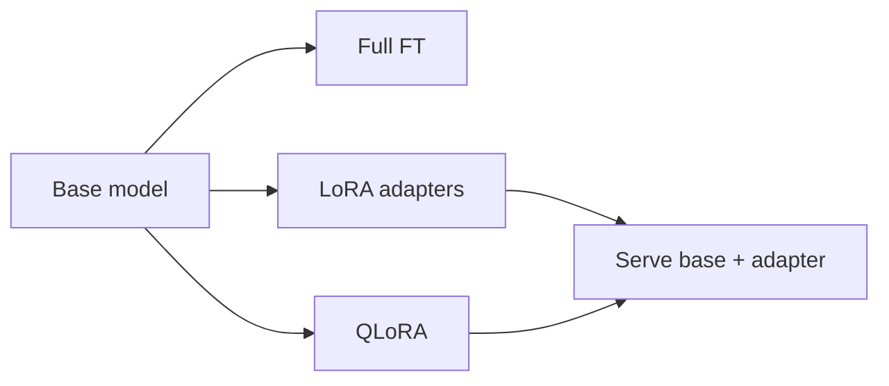

# Fine-Tuning Methods

> Full fine-tuning vs LoRA/QLoRA and practical tradeoffs.

## Definition

Full fine-tuning updates all weights. LoRA injects low-rank adapters into layers; QLoRA combines quantization with LoRA to reduce memory. Preference/alignment methods (DPO, etc.) optimize from comparisons rather than only supervised targets.

## Why it matters

Method choice is mostly about compute budget, serving constraints, and how much behavior shift you need.

## How it works

## Key principles

1. **Prefer PEFT first** — LoRA is the default experiment path.
2. **Freeze what you can** — Less blast radius.
3. **Track adapter versions** — Treat adapters like model artifacts.

## Common applications

| Application | Description |
|-------------|-------------|
| SFT | Supervised instruction data |
| Preference tuning | Better response ranking |
| Domain adapters | Per-tenant styles |

## Common mistakes

- Tiny datasets + large learning rates
- Deploying without catastrophic-forgetting checks

## Further reading

- [Dataset & eval for FT](fine-tuning-data-and-eval.md)
- [Deep Learning training loop](../deep-learning/training-loop-and-optimization.md)
