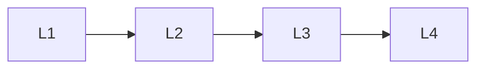

# Methods

> Section of the **llm-fine-tuning** handbook.

## Lessons

| # | Lesson |
|---|--------|
| 1 | [Fine-Tuning Methods Overview](01-fine-tuning-methods.md) |
| 2 | [LoRA and QLoRA](02-lora-and-qlora.md) |
| 3 | [Adapters and Full Fine-Tuning](03-adapters-and-full-ft.md) |
| 4 | [DPO, ORPO, and RLHF Overview](04-dpo-orpo-rlhf.md) |

**Topic hub:** [../README.md](../README.md)
