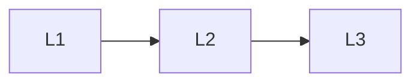

# Pitfalls

> Section of the **llm-fine-tuning** handbook.

## Lessons

| # | Lesson |
|---|--------|
| 1 | [Catastrophic Forgetting](01-catastrophic-forgetting.md) |
| 2 | [Overfitting Style and Spurious Patterns](02-overfit-style.md) |
| 3 | [License and Data Risk](03-license-and-data-risk.md) |

**Topic hub:** [../README.md](../README.md)
