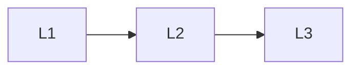

# Training Ops

> Section of the **llm-fine-tuning** handbook.

## Lessons

| # | Lesson |
|---|--------|
| 1 | [Training Configs](01-training-configs.md) |
| 2 | [Checkpoints and Artifacts](02-checkpoints-and-artifacts.md) |
| 3 | [GPUs and Training Cost](03-gpus-and-cost.md) |

**Topic hub:** [../README.md](../README.md)
