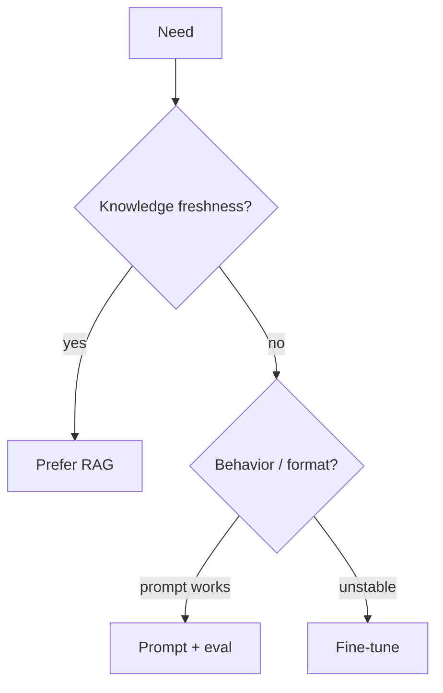

# When to Fine-Tune

> A decision guide: prompting, RAG, or weight updates.

## Definition

Fine-tune when you need consistent style/format, domain language, or behaviors that prompting cannot stabilize — not merely to 'add knowledge' that belongs in a datastore.

## Why it matters

FT is expensive to iterate and can regress general abilities. Most knowledge problems are RAG problems.

## How it works

## Key principles

1. **RAG for facts** — Documents change; weights shouldn't.
2. **FT for behavior** — Tone, schema, domain dialect.
3. **Always keep a baseline** — Prompt-only must be beaten on eval.

## Common applications

| Application | Description |
|-------------|-------------|
| Brand voice | Support tone adapters |
| Structured extraction | JSON-heavy tasks |
| Domain jargon | Legal/medical phrasing — with compliance review |

## Common mistakes

- Fine-tuning to stuff a PDF into weights
- No comparison against strong prompted baseline

## Further reading

- [Fine-tuning methods](fine-tuning-methods.md)
- [RAG](../rag/README.md)
