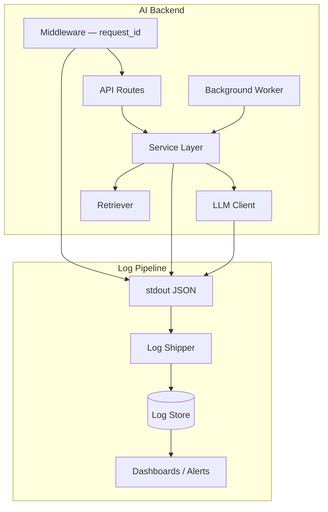
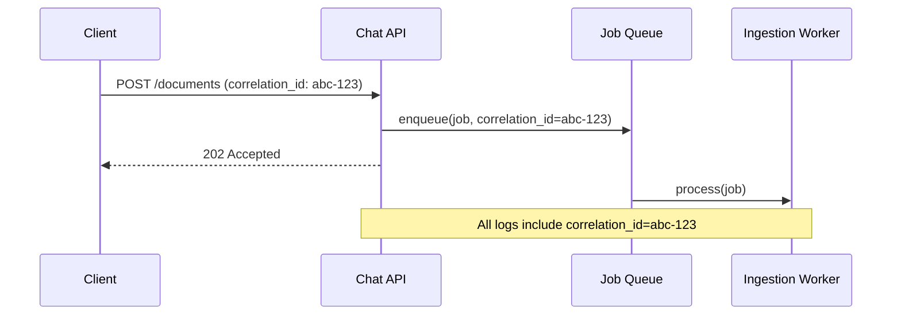
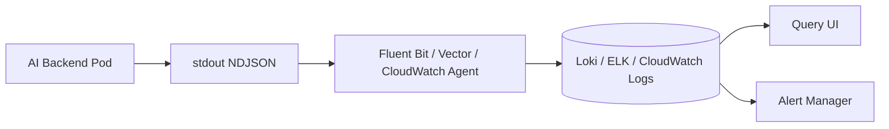

# Backend Logging for AI

> reference for production-grade logging in AI backends — structured events, correlation across async pipelines, audit trails, and log pipelines that scale with LLM traffic.

## Table of Contents

- [Overview](#overview)
- [Why Backend Logging Differs for AI](#why-backend-logging-differs-for-ai)
- [Logging Architecture](#logging-architecture)
- [Structured Logging](#structured-logging)
- [JSON Logging](#json-logging)
- [Request IDs](#request-ids)
- [Correlation IDs](#correlation-ids)
- [Log Context and Propagation](#log-context-and-propagation)
- [Log Levels in Production](#log-levels-in-production)
- [What to Log in AI Backends](#what-to-log-in-ai-backends)
- [Audit Logging](#audit-logging)
- [Production Logging Pipeline](#production-logging-pipeline)
- [FastAPI Integration](#fastapi-integration)
- [Background Workers and Async Tasks](#background-workers-and-async-tasks)
- [Log Volume and Sampling](#log-volume-and-sampling)
- [Security and Redaction](#security-and-redaction)
- [Best Practices](#best-practices)
- [Production Considerations](#production-considerations)
- [Common Mistakes](#common-mistakes)
- [Interview Preparation](#interview-preparation)
- [Navigation](#navigation)

---

## Overview

Backend logging is the **primary diagnostic signal** for AI services in production.
Unlike traditional CRUD APIs, an AI backend emits logs across retrieval, embedding, reranking, tool calls, and streaming token delivery — often in a single user request.

This document is a **deep dive**. It assumes you have read:

- [Logging and Error Handling](logging-and-error-handling.md) — logging strategy, exception boundaries, retries
- [Configuration and Secrets](../foundations/configuration-and-secrets.md) — `LOG_LEVEL`, `APP_ENV`, safe settings loading

Here we focus on **backend logging infrastructure**: how logs are formatted, correlated, shipped, and audited — not on exception handling (covered in this handbook).



> **Production Standard:** Every log line in production is JSON, includes `request_id`, uses stable field names, and never contains secrets or raw PII. Logs go to stdout; the platform ships them.

---

## Why Backend Logging Differs for AI

| Traditional Backend | AI Backend |
|---------------------|------------|
| One DB query, one response | Multi-stage pipeline: embed → retrieve → rerank → generate |
| Deterministic latency | Variable latency (100ms–60s+) |
| Errors are validation or DB | Provider 429, context overflow, tool loop, empty retrieval |
| Low log volume per request | High volume if prompts/responses logged naively |
| Single service trace | API + worker + embedding service correlation |

AI-specific questions logging must answer:

- Which `correlation_id` ties the HTTP request to the Celery ingestion job?
- Did we serve from cache or call the LLM?
- How many tokens did tenant `acme` consume in this request?
- Who approved the agent to call the `delete_record` tool?

See [Backend Fundamentals for AI](../backend-engineering/backend-fundamentals-for-ai.md) for middleware and request lifecycle, and [Monitoring Foundation for AI Backends](../monitoring/monitoring-foundation-for-ai-backends.md) for metrics and traces that complement logs.

---

## Logging Architecture

### Layer Responsibilities

| Layer | Responsibility | Key Fields |
|-------|----------------|------------|
| Middleware | Assign IDs, log request/response summary | `request_id`, `method`, `path`, `status`, `duration_ms` |
| API routes | Auth failures, validation errors | `operation`, `error_code` |
| Services | Business events, stage timing | `operation`, `latency_ms`, `model`, `chunks_found` |
| Infrastructure clients | External call outcomes | `provider`, `status_code`, `retry_count` |
| Audit logger | Security-sensitive actions | `actor`, `action`, `resource`, `outcome` |

### Single Configuration Point

Configure logging once at application startup — not per module.
Load `log_level` and `json_format` from settings (see [Configuration and Secrets](../foundations/configuration-and-secrets.md)).

```python
# app/logging/setup.py
import logging
import sys


def configure_logging(log_level: str = "info", json_format: bool = True) -> None:
    root = logging.getLogger()
    root.handlers.clear()
    root.setLevel(log_level.upper())

    handler = logging.StreamHandler(sys.stdout)
    if json_format:
        from app.logging.formatters import JsonFormatter
        handler.setFormatter(JsonFormatter())
    else:
        handler.setFormatter(
            logging.Formatter("%(asctime)s %(levelname)s [%(name)s] %(message)s")
        )
    root.addHandler(handler)

    for name in ("httpx", "httpcore", "openai", "urllib3", "uvicorn.access"):
        logging.getLogger(name).setLevel(logging.WARNING)
```

### Logger Naming Convention

Use hierarchical logger names matching module paths:

```python
logger = logging.getLogger("app.services.rag")
logger = logging.getLogger("app.infrastructure.llm.openai")
logger = logging.getLogger("app.audit")
```

Avoid a single global logger — namespaces help filter in log aggregators.

---

## Structured Logging

Structured logging means each log event is a **record with named fields**, not a free-form string.
The `message` field is an event name; dimensions live in `extra`.

### Event Naming

Use `snake_case` event names — stable, searchable, version-independent:

| Good | Bad |
|------|-----|
| `retrieval_completed` | `RAG done for user` |
| `llm_call_failed` | `OpenAI error!!!` |
| `ingestion_job_started` | `Starting job {id}` |

### The `operation` Field

Include `operation` on every service-level log for consistent dashboards:

```python
logger.info(
    "retrieval_completed",
    extra={
        "operation": "rag.retrieve",
        "chunks_found": 8,
        "top_score": 0.91,
        "latency_ms": 142.3,
    },
)
```

### Stable Schema

Document your log schema — field names should not change between deploys without a migration plan:

| Field | Type | Description |
|-------|------|-------------|
| `timestamp` | ISO 8601 UTC | Event time |
| `level` | string | DEBUG, INFO, WARNING, ERROR |
| `logger` | string | Python logger name |
| `message` | string | Event name |
| `request_id` | string | Per-HTTP-request identifier |
| `correlation_id` | string | Cross-service workflow identifier |
| `tenant_id` | string | Multi-tenant isolation |
| `operation` | string | Logical operation path |
| `latency_ms` | float | Stage or total duration |

---

## JSON Logging

Production AI backends emit **JSON to stdout**.
Container orchestrators and log agents parse JSON without custom regex.

### JsonFormatter Implementation

```python
# app/logging/formatters.py
import json
import logging
from datetime import datetime, timezone

from app.logging.context import get_log_context


class JsonFormatter(logging.Formatter):
    RESERVED = {
        "name", "msg", "args", "levelname", "levelno", "pathname",
        "filename", "module", "exc_info", "exc_text", "stack_info",
        "lineno", "funcName", "created", "msecs", "relativeCreated",
        "thread", "threadName", "processName", "process", "message",
    }

    def format(self, record: logging.LogRecord) -> str:
        payload: dict = {
            "timestamp": datetime.now(timezone.utc).isoformat(),
            "level": record.levelname,
            "logger": record.name,
            "message": record.getMessage(),
            **get_log_context(),
        }
        for key, value in record.__dict__.items():
            if key not in self.RESERVED and not key.startswith("_"):
                payload[key] = value
        if record.exc_info:
            payload["exception"] = self.formatException(record.exc_info)
        return json.dumps(payload, default=str)
```

### Human-Readable Local Development

Use plain text locally; JSON in staging and production:

| Environment | Format | Rationale |
|-------------|--------|-----------|
| `development` | Plain text (optional) | Easier terminal reading |
| `staging` | JSON | Validate pipeline before prod |
| `production` | JSON | Required for aggregation |

Configure via `JSON_LOGS=true` in settings — see [Configuration Management for Backends](../backend-engineering/configuration-management-for-backends.md).

### One JSON Object Per Line

Never pretty-print JSON logs in production.
Log shippers expect **NDJSON** (newline-delimited JSON) — one object per line.

---

## Request IDs

A **request ID** uniquely identifies a single HTTP request through your backend.
Every log line for that request must include the same `request_id`.

### Generation

```python
from uuid import uuid4

def new_request_id() -> str:
    return str(uuid4())
```

Accept client-provided IDs only when validated — otherwise generate server-side:

```python
REQUEST_ID_HEADER = "X-Request-ID"

def resolve_request_id(incoming: str | None) -> str:
    if incoming and len(incoming) <= 64 and incoming.isalnum():
        return incoming
    return new_request_id()
```

### Response Header

Return the ID to clients for support tickets:

```python
response.headers[REQUEST_ID_HEADER] = request_id
```

### Middleware Assignment

```python
# app/middleware/request_context.py
from starlette.middleware.base import BaseHTTPMiddleware
from starlette.requests import Request

from app.logging.context import set_request_context, clear_request_context


class RequestContextMiddleware(BaseHTTPMiddleware):
  async def dispatch(self, request: Request, call_next):
      request_id = resolve_request_id(request.headers.get(REQUEST_ID_HEADER))
      set_request_context(request_id=request_id, tenant_id=_extract_tenant(request))
      try:
          response = await call_next(request)
          response.headers[REQUEST_ID_HEADER] = request_id
          return response
      finally:
          clear_request_context()
```

### Access Log Entry

Log one summary line per request at INFO:

```python
logger.info(
    "http_request_completed",
    extra={
        "operation": "http.request",
        "method": request.method,
        "path": request.url.path,
        "status_code": response.status_code,
        "duration_ms": round(duration_ms, 2),
    },
)
```

---

## Correlation IDs

A **correlation ID** spans multiple services or async steps in one **business workflow**.
Use it when a user action triggers API + worker + embedding service.

| ID Type | Scope | Example |
|---------|-------|---------|
| `request_id` | Single HTTP request | Chat message POST |
| `correlation_id` | End-to-end workflow | Upload → ingest → embed → index |
| `session_id` | User conversation | Multi-turn chat thread |
| `job_id` | Background job | Celery task for document ingestion |

### When to Use Correlation IDs



Pass `correlation_id` explicitly into workers — do not assume `request_id` survives the queue boundary:

```python
# API enqueues
await queue.enqueue(
    "ingest_document",
    document_id=doc_id,
    correlation_id=correlation_id,
    request_id=request_id,
)

# Worker logs
logger.info(
    "ingestion_started",
    extra={
        "operation": "ingest.document",
        "correlation_id": correlation_id,
        "job_id": job_id,
        "document_id": document_id,
    },
)
```

### Client-Supplied Correlation

Accept `X-Correlation-ID` from API gateways or BFF layers.
If absent, default `correlation_id` to `request_id` for simple flows.

---

## Log Context and Propagation

Use **`contextvars`** for async-safe context — not thread locals.

```python
# app/logging/context.py
from contextvars import ContextVar
from typing import Any

_request_id: ContextVar[str] = ContextVar("request_id", default="")
_correlation_id: ContextVar[str] = ContextVar("correlation_id", default="")
_tenant_id: ContextVar[str] = ContextVar("tenant_id", default="")


def set_request_context(
    request_id: str,
    correlation_id: str = "",
    tenant_id: str = "",
) -> None:
    _request_id.set(request_id)
    _correlation_id.set(correlation_id or request_id)
    _tenant_id.set(tenant_id)


def get_log_context() -> dict[str, Any]:
    ctx: dict[str, Any] = {}
    if rid := _request_id.get():
        ctx["request_id"] = rid
    if cid := _correlation_id.get():
        ctx["correlation_id"] = cid
    if tid := _tenant_id.get():
        ctx["tenant_id"] = tid
    return ctx


def clear_request_context() -> None:
    _request_id.set("")
    _correlation_id.set("")
    _tenant_id.set("")
```

### Propagation Checklist

| Boundary | Action |
|----------|--------|
| HTTP middleware | Set context at request start, clear in `finally` |
| Background task | Pass IDs as task kwargs; set context at task start |
| Outbound HTTP | Forward `X-Request-ID`, `X-Correlation-ID` headers |
| Message queue | Serialize IDs in message payload |
| Streaming SSE | Include `request_id` in first event metadata |

---

## Log Levels in Production

| Level | Production Use | AI Examples |
|-------|----------------|-------------|
| `DEBUG` | Off globally; enable per-request sampling only | Prompt previews, full retrieval scores |
| `INFO` | Normal lifecycle | Request complete, stage timing, model selected |
| `WARNING` | Degraded but serving | Empty retrieval, retry succeeded, rate limit at 80% |
| `ERROR` | Failed operation | LLM call failed after retries, DB timeout |
| `CRITICAL` | Process cannot continue | Invalid config, required dependency unreachable at boot |

### Per-Environment Defaults

| Environment | Root Level | Third-Party Libraries |
|-------------|------------|----------------------|
| development | `DEBUG` | `INFO` when debugging HTTP |
| staging | `INFO` | `WARNING` |
| production | `INFO` | `WARNING` |

Load from `LOG_LEVEL` via [Configuration and Secrets](../foundations/configuration-and-secrets.md).

### Dynamic Level Changes

Avoid changing log levels at runtime in production without audit.
If needed, expose an admin endpoint protected by auth that updates a runtime flag — log who changed it.

---

## What to Log in AI Backends

### HTTP Layer

| Field | Log? |
|-------|------|
| Method, path, status, duration | Yes |
| `request_id`, `tenant_id` | Yes |
| Full request body | No (PII risk) |
| Authorization header | Never |

### RAG Pipeline

```python
logger.info(
    "rag_stage_completed",
    extra={
        "operation": "rag.embed_query",
        "latency_ms": 45.2,
        "embedding_model": settings.embedding_model,
        "query_length": len(query),
    },
)

logger.info(
    "rag_stage_completed",
    extra={
        "operation": "rag.retrieve",
        "latency_ms": 120.5,
        "chunks_found": 5,
        "top_score": 0.88,
        "index_name": "docs_v2",
    },
)
```

### LLM Calls

| Field | Production |
|-------|------------|
| `model` | Yes |
| `input_tokens`, `output_tokens` | Yes |
| `latency_ms`, `finish_reason` | Yes |
| `prompt_version` | Yes |
| Raw prompt / completion | No — use fingerprint or DEBUG locally |

```python
import hashlib

def prompt_fingerprint(text: str) -> str:
    return hashlib.sha256(text.encode()).hexdigest()[:16]

logger.info(
    "llm_call_completed",
    extra={
        "operation": "llm.complete",
        "model": model,
        "input_tokens": usage.input_tokens,
        "output_tokens": usage.output_tokens,
        "latency_ms": latency_ms,
        "prompt_fingerprint": prompt_fingerprint(prompt),
        "prompt_version": "v3.2",
    },
)
```

### Agent and Tool Calls

```python
logger.info(
    "agent_tool_invoked",
    extra={
        "operation": "agent.tool_call",
        "tool_name": "search_documents",
        "iteration": 2,
        "latency_ms": 340.0,
    },
)
```

---

## Audit Logging

**Audit logs** record security-sensitive and compliance-relevant actions.
They are append-only, tamper-evident, and retained longer than application logs.

### Audit vs Application Logs

| Aspect | Application Log | Audit Log |
|--------|-----------------|-----------|
| Purpose | Debugging, operations | Compliance, security review |
| Retention | 30–90 days typical | 1–7 years (policy-dependent) |
| Content | Latency, errors, stages | Who did what to which resource |
| Mutability | Rotated/deleted | Immutable store preferred |
| PII | Minimized | May include actor identity (policy) |

### What to Audit in AI Backends

| Event | Fields |
|-------|--------|
| Login / API key use | `actor`, `auth_method`, `ip`, `outcome` |
| Document upload/delete | `actor`, `document_id`, `action`, `tenant_id` |
| Admin config change | `actor`, `setting`, `old_value_hash`, `new_value_hash` |
| Agent tool execution | `actor`, `tool_name`, `parameters_hash`, `outcome` |
| Model override | `actor`, `model`, `reason` |
| Data export | `actor`, `export_scope`, `record_count` |

### Separate Audit Logger

```python
# app/logging/audit.py
import logging

audit_logger = logging.getLogger("app.audit")


def audit(
    action: str,
    actor: str,
    resource: str,
    outcome: str,
    **kwargs,
) -> None:
    audit_logger.info(
        action,
        extra={
            "log_type": "audit",
            "actor": actor,
            "resource": resource,
            "outcome": outcome,
            **kwargs,
        },
    )
```

Route audit logs to a dedicated sink (separate index, S3 bucket, or SIEM) via log shipper filters on `log_type: audit`.

### Never Audit Secrets

Log that a key was **rotated**, not the key value:

```python
audit("api_key_rotated", actor=admin_id, resource="openai_api_key", outcome="success")
```

---

## Production Logging Pipeline



### Twelve-Factor Alignment

- **Logs are event streams** — write to stdout, not files inside containers.
- **No log rotation in app** — the platform handles retention.
- **Stateless processes** — logs leave the pod immediately.

### Log Shippers

| Tool | Typical Deployment |
|------|-------------------|
| Fluent Bit | Kubernetes DaemonSet |
| Vector | Kubernetes or sidecar |
| CloudWatch Agent | AWS ECS/EKS |
| Datadog Agent | Sidecar or host agent |

### Indexing Strategy

Index high-cardinality fields carefully:

| Field | Index? | Notes |
|-------|--------|-------|
| `request_id` | Yes | Primary lookup |
| `tenant_id` | Yes | Multi-tenant filtering |
| `operation` | Yes | Dashboard grouping |
| `message` | Yes | Event name search |
| `prompt_fingerprint` | Optional | Debug quality regressions |
| Raw message body | No | Too large, PII risk |

---

## FastAPI Integration

### Lifespan Hook

```python
from contextlib import asynccontextmanager
from fastapi import FastAPI

from app.logging.setup import configure_logging
from app.config import get_settings


@asynccontextmanager
async def lifespan(app: FastAPI):
    settings = get_settings()
    configure_logging(
        log_level=settings.log_level,
        json_format=settings.json_logs,
    )
    yield


app = FastAPI(lifespan=lifespan)
```

### Dependency Injection for Loggers

```python
import logging
from fastapi import Depends


def get_service_logger() -> logging.Logger:
    return logging.getLogger("app.services.chat")


@router.post("/v1/chat")
async def chat(
    request: ChatRequest,
    logger: logging.Logger = Depends(get_service_logger),
):
    logger.info("chat_started", extra={"operation": "chat.generate"})
    ...
```

Wire settings through [Configuration Management for Backends](../backend-engineering/configuration-management-for-backends.md).

---

## Background Workers and Async Tasks

Workers do not inherit HTTP middleware context.
**Explicitly pass and restore** IDs:

```python
# Celery task
@celery_app.task
def ingest_document(document_id: str, correlation_id: str, request_id: str) -> None:
    set_request_context(request_id=request_id, correlation_id=correlation_id)
    try:
        logger.info(
            "ingestion_started",
            extra={"operation": "worker.ingest", "document_id": document_id},
        )
        ...
    finally:
        clear_request_context()
```

For ARQ, FastAPI `BackgroundTasks`, or asyncio tasks — same pattern: pass IDs, set context at entry, clear in `finally`.

---

## Log Volume and Sampling

AI backends can generate **massive log volume** if every token or chunk is logged.

### Volume Controls

| Technique | When |
|-----------|------|
| Never log raw prompts in prod | Always |
| Aggregate token metrics to Prometheus | Per-minute rates, not per-token logs |
| Sample DEBUG traces | 1% of requests for deep diagnosis |
| Cap `extra` field sizes | Truncate embedding vectors, chunk text |
| Tune library log levels | `httpx` at WARNING |

### Sampling Example

```python
import random

def should_sample_debug(sample_rate: float = 0.01) -> bool:
    return random.random() < sample_rate

if should_sample_debug():
    logger.debug(
        "retrieval_debug",
        extra={"scores": scores[:5], "operation": "rag.retrieve"},
    )
```

---

## Security and Redaction

| Never Log | Safe Alternative |
|-----------|------------------|
| API keys, JWTs | `key_id` or `key_prefix` |
| Full prompts with PII | `prompt_fingerprint`, length |
| Credit card, SSN | Redact before log call |
| Settings dump | `safe_repr()` with `SecretStr` redaction |

See [Configuration and Secrets](../foundations/configuration-and-secrets.md) for `SecretStr` and safe settings representation.

```python
from pydantic import SecretStr

def safe_repr(value: SecretStr) -> str:
    return "***"
```

---

## Best Practices

| Practice | Benefit |
|----------|---------|
| JSON to stdout in production | Platform-agnostic shipping |
| `request_id` on every line | End-to-end request tracing |
| `correlation_id` across async steps | Workflow debugging |
| Stable `operation` field names | Consistent dashboards |
| Separate audit logger | Compliance isolation |
| Event names, not sentences | Reliable search |
| `contextvars` for async | Correct context in asyncio |
| Tune third-party log levels | Cost control |
| Document log schema | Onboarding and alert authoring |
| Fingerprints instead of raw prompts | PII safety |

---

## Production Considerations

- **Retention** — application logs 30–90 days; audit logs per compliance policy.
- **Cost** — log ingestion priced per GB; structured verbosity has a bill.
- **Alerting** — alert on error rate spikes and audit failures, not single LLM timeouts.
- **Multi-tenant** — always include `tenant_id`; consider per-tenant log routing for enterprise.
- **GDPR** — may prohibit prompt logging; use fingerprints and metadata only.
- **Shutdown** — flush handlers on SIGTERM so last requests are not lost.
- **Clock skew** — use UTC ISO timestamps; NTP-synced nodes.
- **Correlation with traces** — include `trace_id` when OpenTelemetry is enabled (see [Monitoring Foundation](../monitoring/monitoring-foundation-for-ai-backends.md)).

---

## Common Mistakes

| Mistake | Impact | Fix |
|---------|--------|-----|
| `print()` instead of logging | No structure, no levels | `logging` + JSON formatter |
| No `request_id` in workers | Broken trace across queue | Pass IDs in task kwargs |
| Logging full prompts in prod | PII violation, huge volume | Fingerprints, DEBUG locally |
| Pretty-printed JSON | Breaks NDJSON parsers | `json.dumps` one line |
| Same logger for audit and debug | Compliance risk | Separate `app.audit` logger |
| `httpx` at DEBUG in prod | Log bill explosion | WARNING for libraries |
| Thread locals in async | Wrong `request_id` on concurrent requests | `contextvars` |
| Logging inside tight loops | Per-token log lines | Aggregate at stage end |
| No access log summary | Cannot compute p99 latency from logs | One `http_request_completed` per request |
| Secrets in `extra` fields | Credential leak in aggregator | Redact before logging |

---

## Interview Preparation

### Frequently Asked Questions

**Q1: What is the difference between a request ID and a correlation ID?**

> **Strong answer:** `request_id` identifies a single HTTP request through one service. `correlation_id` spans a business workflow that may cross multiple services and async jobs — e.g., document upload API call plus ingestion worker. Default `correlation_id` to `request_id` for simple flows; generate a workflow-level ID when enqueueing background work.

**Q2: How do you structure logging in a production AI backend?**

> **Strong answer:** Central JSON logging to stdout, configured once at startup from typed settings. Middleware assigns `request_id` via contextvars. Services log with stable `operation` fields and `extra` for latency, token counts, model id. Separate audit logger for security events. Never log secrets or raw PII prompts. Library log levels tuned to WARNING. IDs propagated to workers explicitly.

**Q3: What would you include in an audit log for an AI agent backend?**

> **Strong answer:** Actor identity, action, resource, outcome, timestamp, tenant_id. For agents: tool invocations with tool name and parameter hash — not raw parameters if they contain PII. Admin actions: model changes, permission grants, data exports. Immutable storage, longer retention than app logs, separate index.

**Q4: How do you control log volume in LLM applications?**

> **Strong answer:** Never log raw prompts/completions in production — use fingerprints and token counts. Push aggregates to metrics (Prometheus) instead of per-token logs. Sample DEBUG traces. Cap extra field sizes. Set httpx/openai loggers to WARNING. One summary log per pipeline stage, not per chunk.

### Real-World Scenario

**Scenario:** Support receives a ticket: "My chat response was wrong at 3:42 PM." The user provides their `X-Request-ID` from the response header.

> **Discussion points:** Search logs by `request_id`; trace `operation` sequence: retrieve → rerank → generate; check `chunks_found`, `top_score`, `model`, `prompt_version`; compare `latency_ms` per stage; verify `tenant_id`; check for `retrieval_empty` warnings; cross-reference metrics for provider errors at that timestamp; do not expose raw prompt to support — use fingerprints.

---

## Navigation

### Prerequisites

- [Logging and Error Handling](logging-and-error-handling.md) — logging strategy, retries, exception boundaries
- [Configuration and Secrets](../foundations/configuration-and-secrets.md) — `LOG_LEVEL`, `APP_ENV`, safe settings
- [Backend Fundamentals for AI](../backend-engineering/backend-fundamentals-for-ai.md) — middleware, request lifecycle

### Related Topics

- [Configuration Management for Backends](../backend-engineering/configuration-management-for-backends.md) — logging settings in Pydantic
- [Monitoring Foundation for AI Backends](../monitoring/monitoring-foundation-for-ai-backends.md) — metrics and traces
- [Background Processing for AI](../backend-engineering/background-processing-for-ai.md) — worker log propagation

### Next Topics

- [Monitoring Foundation for AI Backends](../monitoring/monitoring-foundation-for-ai-backends.md)
- [Observability Domain](../observability/README.md)
- [Production Incidents Domain](../production-incidents/README.md)

### Future Reading

- [Debugging Domain](../debugging/README.md) — incident investigation workflows
- [Performance Optimization](../performance-optimization/README.md) — latency reduction

---

## See Also

- [Logging Domain README](README.md)
- [Logging and Error Handling](logging-and-error-handling.md)
- [Master Index](../../meta/indexes/MASTER-INDEX.md)

## Changelog

| Version | Date | Changes |
|---------|------|---------|
| 1.0 | 2026-07-13 | Initial release |
