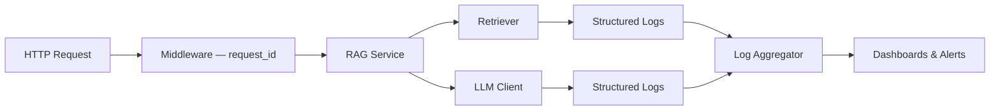
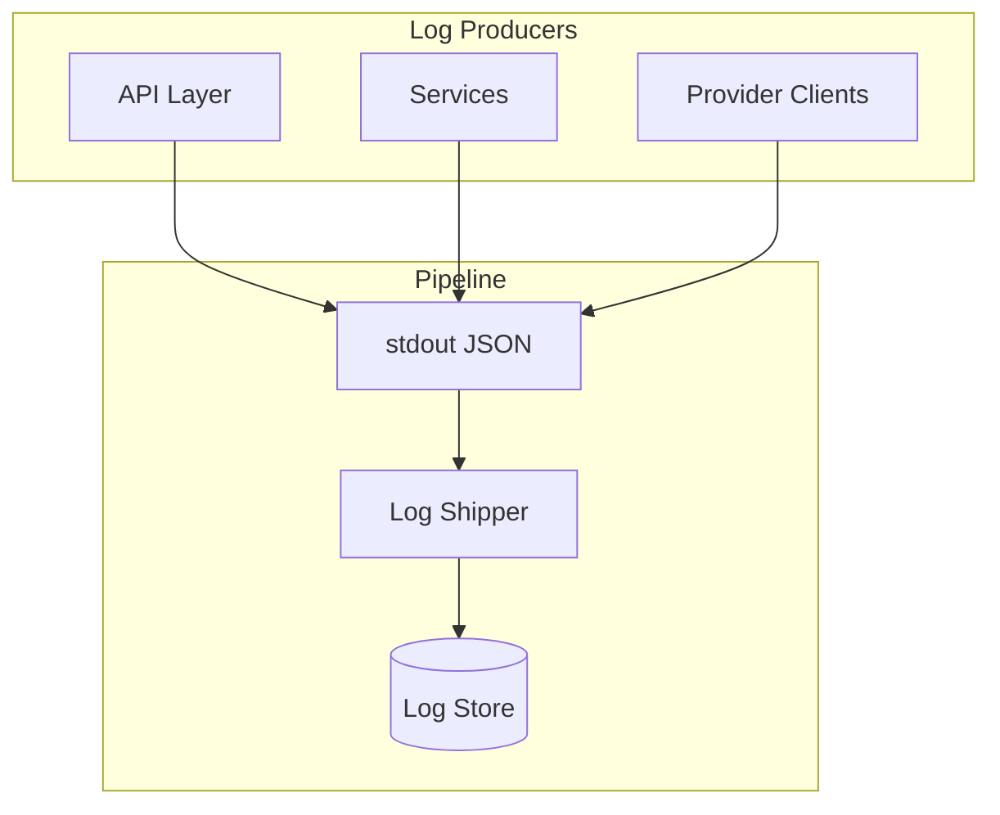
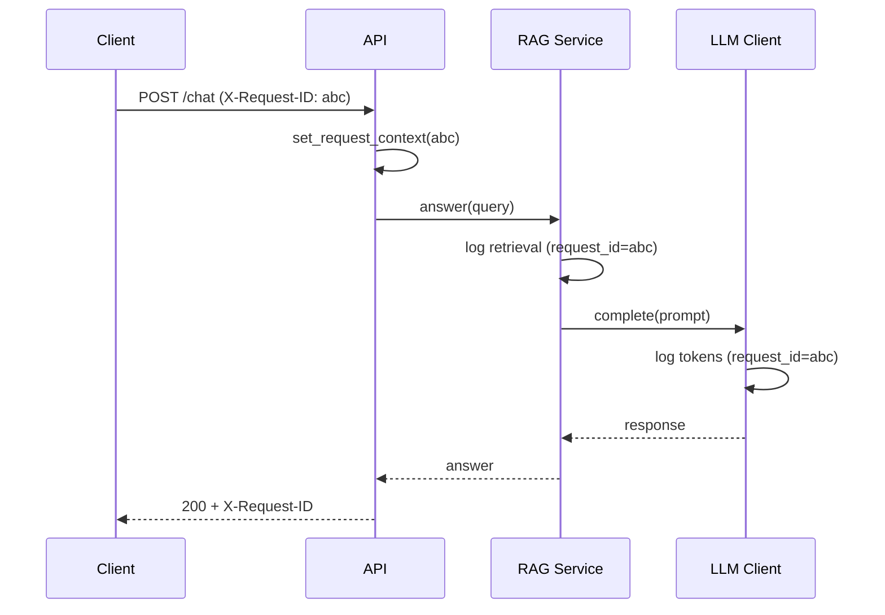
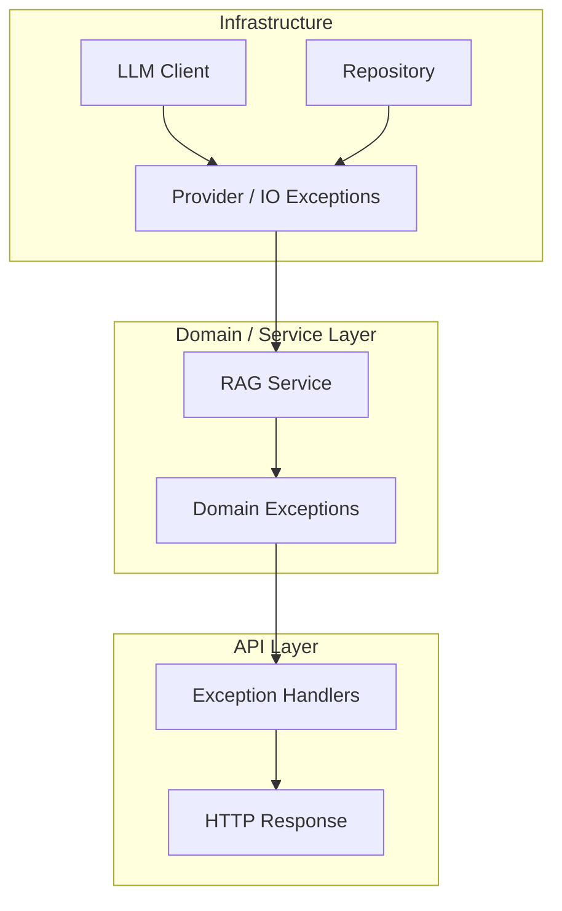
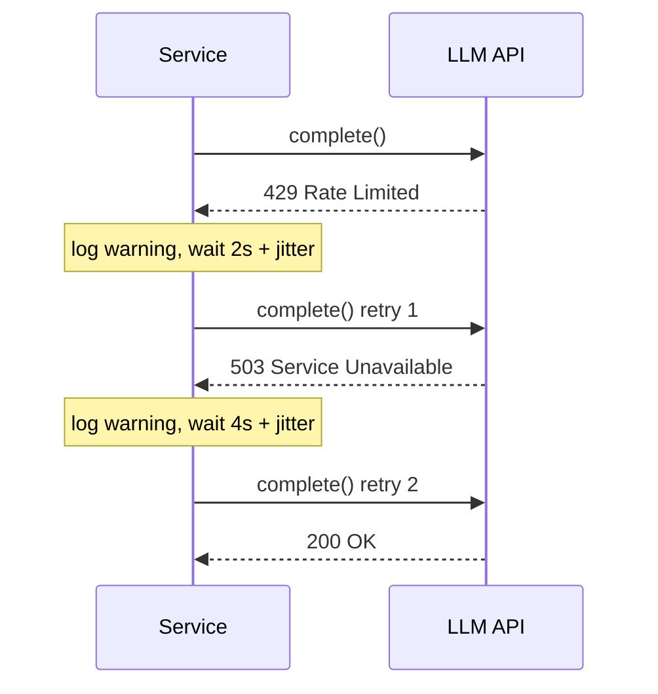
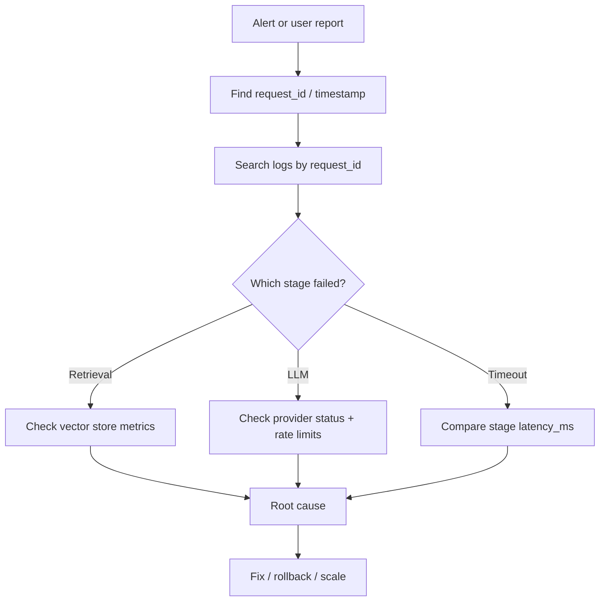

# Logging and Error Handling

> How to observe, debug, and survive failures in production AI systems — structured logging, intentional exception boundaries, retries with backoff, and graceful degradation when models and dependencies fail.

## Table of Contents

- [Why Logging Matters for AI](#why-logging-matters-for-ai)
- [Logging Strategy](#logging-strategy)
- [Structured Logging](#structured-logging)
- [Log Levels](#log-levels)
- [Correlation and Context](#correlation-and-context)
- [What to Log in AI Pipelines](#what-to-log-in-ai-pipelines)
- [Exception Handling Philosophy](#exception-handling-philosophy)
- [Exception Hierarchy](#exception-hierarchy)
- [Retries and Backoff](#retries-and-backoff)
- [Graceful Failures](#graceful-failures)
- [Debugging Production Issues](#debugging-production-issues)
- [Production Diagnostics](#production-diagnostics)
- [Integration with Observability](#integration-with-observability)
- [Best Practices](#best-practices)
- [Production Considerations](#production-considerations)
- [Common Mistakes](#common-mistakes)
- [Interview Preparation](#interview-preparation)
- [Navigation](#navigation)

---

## Why Logging Matters for AI

Traditional apps fail with deterministic errors — constraint violations, 404s, validation failures.
AI services fail in **probabilistic, multi-step, expensive** ways: retrieval returns irrelevant chunks, the model hallucinates, the provider returns 429 after 40 seconds, embedding batches partially fail, agent tool calls loop.

Without structured logs you cannot answer:

- Which `request_id` produced that bad answer?
- Was retrieval empty or was the model at fault?
- How many tokens did this tenant consume in the last hour?
- Did we retry three times before failing — or fail immediately?

| Incident Question | Required Log Signal |
|-------------------|---------------------|
| "Chat broke at 2pm" | `request_id`, timestamp, route, status |
| "Answers got worse" | `model`, `prompt_version`, `retrieval_top_k`, scores |
| "Bill spiked" | `input_tokens`, `output_tokens`, `model`, `tenant_id` |
| "Slow responses" | `latency_ms` per stage: retrieve, embed, generate |
| "Provider errors" | `provider`, `status_code`, `retry_count`, exception type |

> **Production Standard:** Logs are your flight recorder. Structure them for machines (JSON), correlate them across async steps, and never log secrets or raw PII prompts in production.

See [Python for AI Engineering](../python-engineering/python-for-ai-engineering.md) for Python logging setup basics, and [Software Engineering for AI](../foundations/software-engineering-for-ai.md) for service-layer boundaries where errors should be caught and transformed.



---

## Logging Strategy

A logging strategy defines **what** you log, **where** you log from, and **who** consumes logs.

### Layer Responsibilities

| Layer | Logs | Does Not Log |
|-------|------|--------------|
| Middleware | `request_id`, method, path, status, duration | Request bodies with PII |
| API routes | Validation failures, auth denials | Business logic internals |
| Services | Operation start/end, decisions, metrics | Raw prompts in production |
| Infrastructure clients | Provider latency, status codes, retries | API keys, full HTTP bodies |
| Background workers | Job id, stage, progress | Entire document contents |

### Centralized Configuration

Configure logging once at application entry — not per module with conflicting formats.

```python
# app/logging/setup.py
import logging
import sys


def configure_logging(log_level: str = "info", json_format: bool = True) -> None:
    root = logging.getLogger()
    root.handlers.clear()
    root.setLevel(log_level.upper())

    handler = logging.StreamHandler(sys.stdout)
    if json_format:
        from app.logging.formatters import JsonFormatter
        handler.setFormatter(JsonFormatter())
    else:
        handler.setFormatter(
            logging.Formatter("%(asctime)s %(levelname)s [%(name)s] %(message)s")
        )
    root.addHandler(handler)

    # Quiet noisy libraries — critical in AI apps
    for name in ("httpx", "httpcore", "openai", "urllib3", "asyncio"):
        logging.getLogger(name).setLevel(logging.WARNING)
```

Load `log_level` and `json_format` from [Configuration and Secrets](../foundations/configuration-and-secrets.md) — `debug` locally, `info` in production.



---

## Structured Logging

Structured logs are machine-parseable events — typically JSON — with stable field names.
They power search, dashboards, and alerts.

### JSON Formatter

```python
# app/logging/formatters.py
import json
import logging
from datetime import datetime, timezone

from app.logging.context import get_log_context


class JsonFormatter(logging.Formatter):
    RESERVED = {
        "name", "msg", "args", "levelname", "levelno", "pathname",
        "filename", "module", "exc_info", "exc_text", "stack_info",
        "lineno", "funcName", "created", "msecs", "relativeCreated",
        "thread", "threadName", "processName", "process", "message",
    }

    def format(self, record: logging.LogRecord) -> str:
        payload: dict = {
            "timestamp": datetime.now(timezone.utc).isoformat(),
            "level": record.levelname,
            "logger": record.name,
            "message": record.getMessage(),
            **get_log_context(),
        }
        # Merge extra fields passed via logger.info(..., extra={...})
        for key, value in record.__dict__.items():
            if key not in self.RESERVED and not key.startswith("_"):
                payload[key] = value
        if record.exc_info:
            payload["exception"] = self.formatException(record.exc_info)
        return json.dumps(payload, default=str)
```

### Using `extra` Fields

```python
import logging
import time

logger = logging.getLogger(__name__)


async def generate_answer(query: str, request_id: str) -> str:
    start = time.perf_counter()
    logger.info(
        "generation_started",
        extra={
            "operation": "generate_answer",
            "query_length": len(query),
            "request_id": request_id,
        },
    )
    try:
        result = await _call_llm(query)
        latency_ms = (time.perf_counter() - start) * 1000
        logger.info(
            "generation_completed",
            extra={
                "operation": "generate_answer",
                "latency_ms": round(latency_ms, 2),
                "output_length": len(result),
                "status": "success",
            },
        )
        return result
    except Exception:
        logger.exception(
            "generation_failed",
            extra={"operation": "generate_answer", "status": "error"},
        )
        raise
```

### Structured vs. Unstructured

| Unstructured | Structured |
|--------------|------------|
| `logger.info(f"RAG took {ms}ms for {user}")` | `extra={"latency_ms": ms, "tenant_id": tid}` |
| Hard to query in Datadog/ELK | Filter: `operation:generate_answer AND latency_ms:>5000` |
| PII embedded in message string | PII in dedicated fields with redaction policy |

---

## Log Levels

Use levels intentionally — alerts should fire on `ERROR`, not on routine `INFO`.

| Level | When to Use | AI Examples |
|-------|-------------|-------------|
| `DEBUG` | Local troubleshooting only | Full retrieval scores, prompt previews |
| `INFO` | Normal lifecycle events | Request completed, job started, model selected |
| `WARNING` | Recoverable anomalies | Retry succeeded, empty retrieval, rate limit approaching |
| `ERROR` | Operation failed | LLM call failed after retries, DB unreachable |
| `CRITICAL` | Process cannot continue | Config invalid, cannot connect to required dependency at startup |

### Level Guidelines for AI Services

```python
# INFO — business-significant, safe for production volume
logger.info("retrieval_complete", extra={"chunks_found": 5, "top_score": 0.87})

# WARNING — degraded but serving
logger.warning("retrieval_empty", extra={"index": "docs", "fallback": "no_context_mode"})

# ERROR — user-facing failure or data loss risk
logger.error("embedding_batch_failed", extra={"batch_size": 32, "failed_ids": [1, 2]})

# DEBUG — never enable globally in production
logger.debug("prompt_preview", extra={"system_prompt": system[:200]})
```

### Per-Environment Defaults

| Environment | Root Level | Third-Party Libraries |
|-------------|------------|----------------------|
| development | `DEBUG` | `INFO` for httpx when debugging |
| staging | `INFO` | `WARNING` |
| production | `INFO` | `WARNING` |

Configure via `LOG_LEVEL` from settings — see [Configuration and Secrets](../foundations/configuration-and-secrets.md).

---

## Correlation and Context

AI requests span multiple async calls.
Propagate context with `contextvars` — not thread locals.

```python
# app/logging/context.py
from contextvars import ContextVar
from typing import Any

_request_id: ContextVar[str] = ContextVar("request_id", default="")
_tenant_id: ContextVar[str] = ContextVar("tenant_id", default="")


def set_request_context(request_id: str, tenant_id: str = "") -> None:
    _request_id.set(request_id)
    _tenant_id.set(tenant_id)


def get_log_context() -> dict[str, Any]:
    ctx: dict[str, Any] = {}
    if rid := _request_id.get():
        ctx["request_id"] = rid
    if tid := _tenant_id.get():
        ctx["tenant_id"] = tid
    return ctx
```

### FastAPI Middleware

```python
from uuid import uuid4
from starlette.middleware.base import BaseHTTPMiddleware
from starlette.requests import Request

from app.logging.context import set_request_context


class RequestContextMiddleware(BaseHTTPMiddleware):
    async def dispatch(self, request: Request, call_next):
        request_id = request.headers.get("X-Request-ID", str(uuid4()))
        tenant_id = request.headers.get("X-Tenant-ID", "")
        set_request_context(request_id, tenant_id)
        response = await call_next(request)
        response.headers["X-Request-ID"] = request_id
        return response
```



---

## What to Log in AI Pipelines

### RAG Pipeline Fields

| Stage | Recommended Fields |
|-------|-------------------|
| Ingestion | `document_id`, `chunk_count`, `bytes`, `duration_ms` |
| Embedding | `model`, `batch_size`, `latency_ms`, `token_count` |
| Retrieval | `query_hash`, `top_k`, `scores[]`, `chunk_ids[]`, `latency_ms` |
| Generation | `model`, `input_tokens`, `output_tokens`, `latency_ms`, `finish_reason` |
| Agent | `tool_name`, `tool_latency_ms`, `iteration`, `stop_reason` |

### Privacy-Safe Logging

```python
import hashlib


def query_fingerprint(query: str) -> str:
    return hashlib.sha256(query.encode()).hexdigest()[:16]


logger.info(
    "retrieval_complete",
    extra={
        "query_fingerprint": query_fingerprint(query),
        "chunks_found": len(chunks),
        # Do NOT log: query, user email, document body
    },
)
```

### Token and Cost Tracking

```python
logger.info(
    "llm_usage",
    extra={
        "model": response.model,
        "input_tokens": response.input_tokens,
        "output_tokens": response.output_tokens,
        "estimated_cost_usd": compute_cost(response),
        "tenant_id": tenant_id,
    },
)
```

---

## Exception Handling Philosophy

Errors should be **caught at boundaries**, **classified**, **logged with context**, and **translated** into responses users and clients can handle.

### Boundary Model



| Rule | Rationale |
|------|-----------|
| Catch at the outermost layer that can meaningfully respond | Avoid try/except in every function |
| Never bare `except:` | Masks bugs; use specific types |
| Log once at the boundary | Prevents duplicate stack traces |
| Preserve exception chain with `raise ... from e` | Root cause visible in logs |
| Map domain errors to HTTP status codes | Consistent API contract |

See [Backend Fundamentals for AI](../backend-engineering/backend-fundamentals-for-ai.md) for FastAPI exception handlers.

---

## Exception Hierarchy

Define typed exceptions for your AI domain — not generic `Exception`.

```python
# domain/exceptions.py
class AppError(Exception):
    """Base for expected, handleable failures."""
    def __init__(self, message: str, *, code: str = "internal_error"):
        super().__init__(message)
        self.code = code


class RetrievalError(AppError):
    def __init__(self, message: str = "Document retrieval failed"):
        super().__init__(message, code="retrieval_error")


class LLMError(AppError):
    def __init__(self, message: str = "LLM provider error", *, retryable: bool = True):
        super().__init__(message, code="llm_error")
        self.retryable = retryable


class RateLimitError(LLMError):
    def __init__(self, message: str = "Rate limit exceeded", *, retry_after: float | None = None):
        super().__init__(message, retryable=True)
        self.code = "rate_limit"
        self.retry_after = retry_after


class ValidationError(AppError):
    def __init__(self, message: str):
        super().__init__(message, code="validation_error")
```

### Infrastructure Translation

```python
# infrastructure/llm/openai_client.py
from openai import APIStatusError, RateLimitError as OpenAIRateLimit

from domain.exceptions import LLMError, RateLimitError


class OpenAIClient:
    async def complete(self, prompt: str) -> str:
        try:
            response = await self._client.chat.completions.create(...)
            return response.choices[0].message.content or ""
        except OpenAIRateLimit as exc:
            raise RateLimitError(retry_after=_parse_retry_after(exc)) from exc
        except APIStatusError as exc:
            raise LLMError(f"OpenAI API error: {exc.status_code}", retryable=exc.status_code >= 500) from exc
```

### FastAPI Exception Handler

```python
from fastapi import FastAPI, Request
from fastapi.responses import JSONResponse
import logging

from domain.exceptions import AppError, RateLimitError

logger = logging.getLogger(__name__)


def register_exception_handlers(app: FastAPI) -> None:
    @app.exception_handler(AppError)
    async def app_error_handler(request: Request, exc: AppError) -> JSONResponse:
        status = 429 if isinstance(exc, RateLimitError) else 502
        if exc.code == "validation_error":
            status = 400
        logger.warning(
            "app_error",
            extra={"error_code": exc.code, "path": request.url.path},
        )
        body = {"error": exc.code, "message": str(exc)}
        headers = {}
        if isinstance(exc, RateLimitError) and exc.retry_after:
            headers["Retry-After"] = str(int(exc.retry_after))
        return JSONResponse(status_code=status, content=body, headers=headers)
```

---

## Retries and Backoff

Transient failures are normal for LLM APIs — rate limits, 502s, timeouts.
Retry **idempotent** operations with exponential backoff and jitter.

### When to Retry

| Retry | Do Not Retry |
|-------|--------------|
| HTTP 429, 502, 503, 504 | HTTP 400, 401, 403, 404 |
| Connection timeout | Invalid API key |
| Empty response from provider | Validation errors in prompt schema |
| Idempotent read operations | Non-idempotent writes without dedup |

### Tenacity Example

```python
from tenacity import (
    retry,
    retry_if_exception_type,
    stop_after_attempt,
    wait_exponential_jitter,
)
import logging

from domain.exceptions import LLMError, RateLimitError

logger = logging.getLogger(__name__)


def _log_retry(retry_state) -> None:
    exc = retry_state.outcome.exception() if retry_state.outcome else None
    logger.warning(
        "llm_retry",
        extra={
            "attempt": retry_state.attempt_number,
            "exception": type(exc).__name__ if exc else None,
        },
    )


@retry(
    retry=retry_if_exception_type((LLMError, RateLimitError)),
    stop=stop_after_attempt(3),
    wait=wait_exponential_jitter(initial=1, max=30),
    before_sleep=_log_retry,
    reraise=True,
)
async def complete_with_retry(client, prompt: str) -> str:
    return await client.complete(prompt)
```



### Retry Configuration from Settings

```python
# Wire max_retries and timeouts from Configuration and Secrets
class LLMService:
    def __init__(self, client, max_retries: int = 3, timeout: float = 30.0):
        self._client = client
        self._max_retries = max_retries
        self._timeout = timeout
```

### Circuit Breaker (Advanced)

After sustained failures, stop hammering the provider — fail fast and optionally serve cached/fallback responses.
Libraries: `pybreaker`, or custom rolling window counters.

---

## Graceful Failures

Users should receive **honest, safe** responses when subsystems fail — not stack traces or silent garbage.

### Degradation Strategies

| Failure | Graceful Response |
|---------|-------------------|
| Vector store down | Return answer without RAG + disclaimer |
| LLM timeout | Cached response if available; else 503 with retry guidance |
| Embedding model error | Skip document; continue batch |
| Rate limited | Queue request or return 429 with `Retry-After` |
| Tool call failure (agent) | Inform model; let it replan or ask user |

```python
async def answer_with_fallback(self, query: str) -> str:
    try:
        chunks = await self._retriever.search(query)
    except RetrievalError:
        logger.warning("retrieval_degraded", extra={"mode": "no_context"})
        chunks = []

    try:
        return await self._llm.generate(query, context=chunks)
    except LLMError as exc:
        logger.error("llm_unavailable", extra={"retryable": exc.retryable})
        if self._cache:
            cached = await self._cache.get_similar(query)
            if cached:
                logger.info("serving_cached_response")
                return cached
        raise
```

### User-Facing Messages

```python
FALLBACK_MESSAGES = {
    "retrieval_error": "I couldn't search the knowledge base right now. I'll answer from general knowledge.",
    "llm_error": "I'm temporarily unable to generate a response. Please try again in a moment.",
}
```

Never expose internal exception details to clients in production.

---

## Debugging Production Issues

### The Investigation Workflow



### High-Signal Queries

Assuming JSON logs in your aggregator:

```
request_id:"a1b2c3d4" AND level:ERROR
operation:retrieval AND latency_ms:>3000
operation:llm_usage AND model:gpt-4o AND @timestamp:[now-1h TO now]
error_code:rate_limit | stats count by tenant_id
```

### Local Reproduction

1. Pull `request_id` from production logs.
2. Reconstruct inputs from safe fields (`query_fingerprint`, `chunk_ids`, `model`).
3. Replay against staging with `DEBUG` logging enabled.
4. Add a regression test — see [Testing Fundamentals](../foundations/testing-fundamentals.md).

### Debug Endpoints (Guarded)

```python
@app.get("/internal/debug/health-deps", include_in_schema=False)
async def debug_deps(settings: Settings = Depends(get_settings)):
    if settings.app_env == "production":
        raise HTTPException(404)
    # Check LLM, DB, vector store connectivity
    return await run_dependency_checks()
```

---

## Production Diagnostics

### Health vs. Readiness

| Probe | Checks | Fails When |
|-------|--------|------------|
| Liveness | Process responsive | Deadlock, unrecoverable state |
| Readiness | Dependencies available | DB down, cannot serve traffic |
| Startup | Config valid | Missing secrets, bad config |

```python
@app.get("/health/live")
async def liveness() -> dict:
    return {"status": "alive"}


@app.get("/health/ready")
async def readiness(db: DB = Depends(get_db)) -> dict:
    await db.execute("SELECT 1")
    return {"status": "ready"}
```

### Synthetic Checks

Run scheduled probes that execute a minimal RAG query against staging/production and alert on failure or latency regression.

### Runbook Fields in Logs

Embed `service_version`, `git_sha`, and `prompt_version` in every log context at startup — simplifies "which deploy broke it?" questions.

```python
logger.info(
    "service_started",
    extra={
        "version": settings.app_version,
        "git_sha": settings.git_sha,
        "env": settings.app_env,
    },
)
```

---

## Integration with Observability

Logs are one pillar — combine with metrics and traces.

| Signal | Tool Examples | AI Use Case |
|--------|---------------|-------------|
| Logs | ELK, Loki, CloudWatch | Request replay, error details |
| Metrics | Prometheus, Datadog | Token rate, p99 latency, error ratio |
| Traces | OpenTelemetry, Jaeger | End-to-end RAG span breakdown |

```python
# OpenTelemetry span around LLM call (conceptual)
from opentelemetry import trace

tracer = trace.get_tracer(__name__)


async def complete(self, prompt: str) -> str:
    with tracer.start_as_current_span("llm.complete") as span:
        span.set_attribute("llm.model", self._model)
        result = await self._client.complete(prompt)
        span.set_attribute("llm.input_tokens", result.input_tokens)
        return result.content
```

See [Observability Domain](../observability/README.md) and [Monitoring Domain](../monitoring/README.md) for full stack guidance.

---

## Best Practices

| Practice | Benefit |
|----------|---------|
| JSON logs to stdout | Container-native; works with any shipper |
| Stable `operation` field names | Consistent dashboards |
| `request_id` on every log line | End-to-end tracing |
| Log once at exception boundary | Clean stack traces, no duplicates |
| Typed domain exceptions | Predictable API errors |
| Retries with jitter | Avoids thundering herd on provider recovery |
| Redact PII and secrets | Compliance and safety |
| Tune third-party log levels | Prevents log volume explosions |
| Test error paths | See [Testing Fundamentals](../foundations/testing-fundamentals.md) |
| Version prompts and log `prompt_version` | Debug quality regressions |

---

## Production Considerations

- **Log volume** — LLM apps can generate large logs; sample DEBUG, aggregate token metrics separately.
- **Retention** — balance cost vs. incident investigation; 30–90 days hot, archive cold.
- **Alerting** — alert on error rate spikes, not individual LLM timeouts (use SLOs).
- **PII compliance** — GDPR may require prompt logging prohibition; use fingerprints.
- **Multi-tenant** — include `tenant_id` in context; isolate noisy neighbor debugging.
- **Async workers** — propagate `request_id` into Celery/ARQ task kwargs.
- **Cost** — log ingestion priced per GB; structured verbosity has a bill.
- **Shutdown** — flush handlers on SIGTERM so last requests are not lost.

---

## Common Mistakes

| Mistake | Impact | Fix |
|---------|--------|-----|
| `print()` instead of logging | No levels, no aggregation | `logging` + JSON formatter |
| Logging full prompts with PII | Compliance violation | Fingerprints, DEBUG only locally |
| Catching `Exception` everywhere | Swallowed bugs | Catch at boundaries, specific types |
| Retrying non-idempotent writes | Duplicate records/charges | Idempotency keys or no retry |
| No `request_id` | Cannot trace multi-step AI flows | Middleware + contextvars |
| `httpx` at DEBUG in prod | Massive log bills | Set library levels to WARNING |
| Logging and re-raising without chain | Lost root cause | `raise NewError(...) from exc` |
| Generic 500 for all errors | Clients cannot retry correctly | Map to 429/502/503/400 |
| Alerting on every LLM timeout | Alert fatigue | SLO-based alerts |
| Secrets in error messages | Credential leak | Sanitize provider error bodies |

---

## Interview Preparation

### Frequently Asked Questions

**Q1: How do you structure logging in a production AI service?**

> **Strong answer:** Central JSON logging to stdout, configured once at startup. Middleware assigns `request_id` via contextvars. Services log with stable `operation` fields and `extra` for `latency_ms`, token counts, model id. Never log secrets or raw PII prompts. Library log levels tuned down. Logs correlated across RAG stages for debugging.

**Q2: When should you retry an LLM API call?**

> **Strong answer:** Retry transient errors — 429, 5xx, timeouts — with exponential backoff and jitter, capped attempts from config. Do not retry 4xx client errors except possibly 429 with `Retry-After`. Log each retry attempt. Ensure idempotency for operations with side effects. Consider circuit breaker after sustained failures.

**Q3: How do you handle errors in a RAG pipeline without exposing internals to users?**

> **Strong answer:** Infrastructure exceptions translated to domain exceptions at the client boundary. Service layer decides degradation — e.g., proceed without context if retrieval fails. API layer maps domain exceptions to HTTP status and safe messages. Full stack traces logged once with `request_id`, not returned to client.

**Q4: What would you log for an LLM call in production?**

> **Strong answer:** `model`, `input_tokens`, `output_tokens`, `latency_ms`, `finish_reason`, `request_id`, `tenant_id`, `operation`. Not the raw prompt or response body in production. Optionally `prompt_version` and `query_fingerprint` for debugging.

### Real-World Scenario

**Scenario:** Users report chat responses became slow and occasionally empty starting after last night's deploy. Provider status page is green.

> **Discussion points:** Search logs for `latency_ms` p99 by stage before/after deploy; compare `model`, `retrieval_top_k`, `chunks_found`; check for increased `llm_retry` warnings; verify `prompt_version` change; check empty retrieval rate; use `request_id` to trace single slow request; roll back if config change suspected.

---

## Navigation

### Prerequisites

- [Python for AI Engineering](../python-engineering/python-for-ai-engineering.md) — logging section, async context
- [Configuration and Secrets](../foundations/configuration-and-secrets.md) — `LOG_LEVEL`, safe settings
- [Software Engineering for AI](../foundations/software-engineering-for-ai.md) — service boundaries

### Related Topics

- [Backend Fundamentals for AI](../backend-engineering/backend-fundamentals-for-ai.md) — middleware, exception handlers
- [Testing Fundamentals](../foundations/testing-fundamentals.md) — testing error paths and retries
- [Debugging Domain](../debugging/README.md) — deeper troubleshooting workflows

### Next Topics

- [Observability Domain](../observability/README.md)
- [Monitoring Domain](../monitoring/README.md)
- [Production Incidents Domain](../production-incidents/README.md)

### Future Reading

- [Performance Optimization](../performance-optimization/README.md) — latency reduction
- [AI Evaluation](../ai-evaluation/README.md) — quality regression detection

---

## See Also

- [Logging Domain README](README.md)
- [Python for AI Engineering — Logging](../python-engineering/python-for-ai-engineering.md#logging)
- [Master Index](../../meta/indexes/MASTER-INDEX.md)

## Changelog

| Version | Date | Changes |
|---------|------|---------|
| 1.0 | 2026-07-13 | Initial version |
