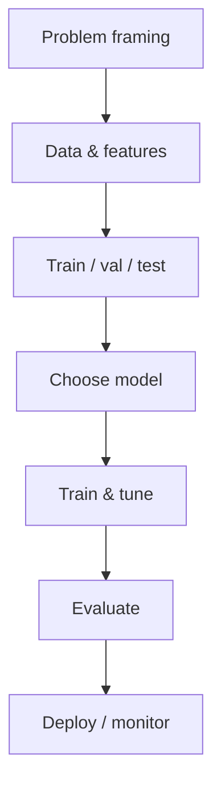

# Machine Learning

> Classical ML foundations — learning from data, model families, training loops, and baselines before deep learning and LLMs.

**Prerequisites:** [Mathematics & Statistics](../mathematics-statistics/README.md) · [Python Frameworks & Libraries](../python-frameworks-libraries/README.md)  
**Unlocks:** [Deep Learning](../deep-learning/README.md) · [Natural Language Processing](../natural-language-processing/README.md)

---

## Definition

**Machine learning (ML)** is building systems that improve performance on a task from data rather than only hand-written rules. Classical ML covers supervised/unsupervised/reinforcement setups, feature engineering, train/validation/test splits, and models like linear/logistic regression, trees, and ensembles.

---

## Learning path

---

## Documents

| # | Topic | Document |
|---|-------|----------|
| 1 | ML mental model | [ml-mental-model.md](ml-mental-model.md) |
| 2 | Supervised learning essentials | [supervised-learning-essentials.md](supervised-learning-essentials.md) |
| 3 | Train-eval discipline | [train-eval-discipline.md](train-eval-discipline.md) |

---

## Related topics

- [Deep Learning](../deep-learning/README.md)
- [LLM Evaluation](../ai-evaluation/README.md)
- [MLOps & LLMOps](../mlops-llmops/README.md)

---

## See also

- [Domains overview](../README.md)
- [Learning Roadmap](../../meta/roadmap.md)
- [Master Index](../../meta/indexes/MASTER-INDEX.md)
