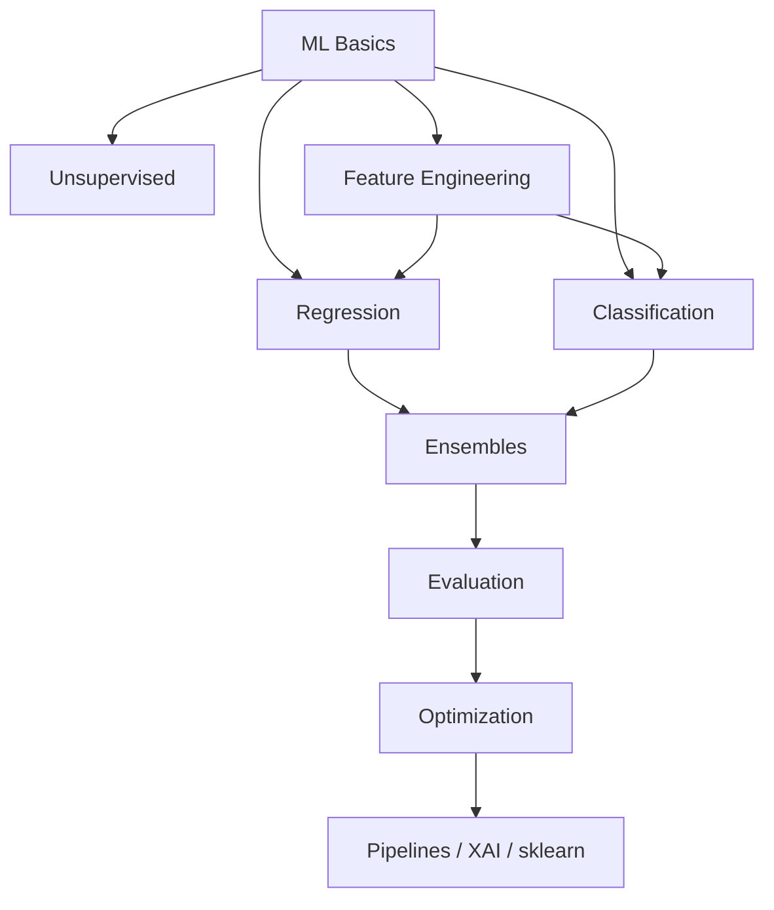

# Machine Learning

> Classical ML curriculum — basics through ensembles, evaluation, feature engineering, and production-minded tooling.

**Prerequisites:** [Mathematics & Statistics](../mathematics-statistics/README.md) · [Python Frameworks & Libraries](../python-frameworks-libraries/README.md)  
**Unlocks:** [Deep Learning](../deep-learning/README.md) · [Natural Language Processing](../natural-language-processing/README.md)

Start with a section hub below (or expand **ML curriculum** in the left sidebar). Each topic has definitions, key ideas, diagrams, and scikit-learn-style examples.

---

## Sections

| # | Section | What you will learn | Hub |
|---|---------|---------------------|-----|
| 1 | **ML Basics** | Workflow, splits, features, loss, overfitting, bias–variance | [ml-basics/](ml-basics/README.md) |
| 2 | **Regression** | Linear → polynomial → Ridge / Lasso / Elastic Net | [regression/](regression/README.md) |
| 3 | **Classification** | Logistic, k-NN, Naive Bayes, SVM, decision trees | [classification/](classification/README.md) |
| 4 | **Ensemble Learning** | Bagging, forests, boosting, XGBoost / LightGBM / CatBoost, stacking | [ensemble-learning/](ensemble-learning/README.md) |
| 5 | **Unsupervised Learning** | Clustering, GMM, PCA, t-SNE, UMAP | [unsupervised-learning/](unsupervised-learning/README.md) |
| 6 | **Model Evaluation** | Metrics, confusion matrix, ROC-AUC, CV, learning curves | [model-evaluation/](model-evaluation/README.md) |
| 7 | **Feature Engineering** | Scaling, encoding, missing values, imbalance | [feature-engineering/](feature-engineering/README.md) |
| 8 | **Model Optimization** | Grid / random / Bayesian search, regularization, early stopping | [model-optimization/](model-optimization/README.md) |
| 9 | **Miscellaneous ML** | Anomalies, recommenders, time series, XAI, pipelines, sklearn | [miscellaneous/](miscellaneous/README.md) |

---

## Hierarchy

### 1. ML Basics

| # | Topic |
|---|-------|
| 1 | [Introduction to Machine Learning](ml-basics/01-introduction-to-machine-learning.md) |
| 2 | [ML Workflow](ml-basics/02-ml-workflow.md) |
| 3 | [Training, Validation & Testing](ml-basics/03-training-validation-testing.md) |
| 4 | [Features & Labels](ml-basics/04-features-and-labels.md) |
| 5 | [Model Parameters & Hyperparameters](ml-basics/05-parameters-and-hyperparameters.md) |
| 6 | [Loss Functions](ml-basics/06-loss-functions.md) |
| 7 | [Optimization](ml-basics/07-optimization.md) |
| 8 | [Overfitting & Underfitting](ml-basics/08-overfitting-and-underfitting.md) |
| 9 | [Bias-Variance Tradeoff](ml-basics/09-bias-variance-tradeoff.md) |

### 2. Regression

| # | Topic |
|---|-------|
| 1 | [Linear Regression](regression/01-linear-regression.md) |
| 2 | [Multiple Linear Regression](regression/02-multiple-linear-regression.md) |
| 3 | [Polynomial Regression](regression/03-polynomial-regression.md) |
| 4 | [Ridge Regression](regression/04-ridge-regression.md) |
| 5 | [Lasso Regression](regression/05-lasso-regression.md) |
| 6 | [Elastic Net Regression](regression/06-elastic-net-regression.md) |

### 3. Classification

| # | Topic |
|---|-------|
| 1 | [Logistic Regression](classification/01-logistic-regression.md) |
| 2 | [K-Nearest Neighbors](classification/02-k-nearest-neighbors.md) |
| 3 | [Naive Bayes](classification/03-naive-bayes.md) |
| 4 | [Support Vector Machines](classification/04-support-vector-machines.md) |
| 5 | [Decision Trees](classification/05-decision-trees.md) |

### 4. Ensemble Learning

| # | Topic |
|---|-------|
| 1 | [Bagging](ensemble-learning/01-bagging.md) |
| 2 | [Random Forest](ensemble-learning/02-random-forest.md) |
| 3 | [Boosting](ensemble-learning/03-boosting.md) |
| 4 | [AdaBoost](ensemble-learning/04-adaboost.md) |
| 5 | [Gradient Boosting](ensemble-learning/05-gradient-boosting.md) |
| 6 | [XGBoost](ensemble-learning/06-xgboost.md) |
| 7 | [LightGBM](ensemble-learning/07-lightgbm.md) |
| 8 | [CatBoost](ensemble-learning/08-catboost.md) |
| 9 | [Stacking & Voting](ensemble-learning/09-stacking-and-voting.md) |

### 5. Unsupervised Learning

| # | Topic |
|---|-------|
| 1 | [Clustering](unsupervised-learning/01-clustering.md) |
| 2 | [K-Means](unsupervised-learning/02-k-means.md) |
| 3 | [Hierarchical Clustering](unsupervised-learning/03-hierarchical-clustering.md) |
| 4 | [DBSCAN](unsupervised-learning/04-dbscan.md) |
| 5 | [Gaussian Mixture Models](unsupervised-learning/05-gaussian-mixture-models.md) |
| 6 | [Dimensionality Reduction](unsupervised-learning/06-dimensionality-reduction.md) |
| 7 | [PCA](unsupervised-learning/07-pca.md) |
| 8 | [t-SNE](unsupervised-learning/08-t-sne.md) |
| 9 | [UMAP](unsupervised-learning/09-umap.md) |

### 6. Model Evaluation

| # | Topic |
|---|-------|
| 1 | [Regression Metrics](model-evaluation/01-regression-metrics.md) |
| 2 | [Classification Metrics](model-evaluation/02-classification-metrics.md) |
| 3 | [Confusion Matrix](model-evaluation/03-confusion-matrix.md) |
| 4 | [Precision & Recall](model-evaluation/04-precision-and-recall.md) |
| 5 | [F1 Score](model-evaluation/05-f1-score.md) |
| 6 | [ROC-AUC](model-evaluation/06-roc-auc.md) |
| 7 | [Cross-Validation](model-evaluation/07-cross-validation.md) |
| 8 | [Learning Curves](model-evaluation/08-learning-curves.md) |

### 7. Feature Engineering

| # | Topic |
|---|-------|
| 1 | [Feature Scaling](feature-engineering/01-feature-scaling.md) |
| 2 | [Feature Transformation](feature-engineering/02-feature-transformation.md) |
| 3 | [Feature Selection](feature-engineering/03-feature-selection.md) |
| 4 | [Feature Extraction](feature-engineering/04-feature-extraction.md) |
| 5 | [Encoding Categorical Variables](feature-engineering/05-encoding-categorical-variables.md) |
| 6 | [Handling Missing Values](feature-engineering/06-handling-missing-values.md) |
| 7 | [Handling Outliers](feature-engineering/07-handling-outliers.md) |
| 8 | [Imbalanced Data](feature-engineering/08-imbalanced-data.md) |

### 8. Model Optimization

| # | Topic |
|---|-------|
| 1 | [Hyperparameter Tuning](model-optimization/01-hyperparameter-tuning.md) |
| 2 | [Grid Search](model-optimization/02-grid-search.md) |
| 3 | [Random Search](model-optimization/03-random-search.md) |
| 4 | [Bayesian Optimization](model-optimization/04-bayesian-optimization.md) |
| 5 | [Regularization](model-optimization/05-regularization.md) |
| 6 | [Early Stopping](model-optimization/06-early-stopping.md) |

### 9. Miscellaneous ML

| # | Topic |
|---|-------|
| 1 | [Anomaly Detection](miscellaneous/01-anomaly-detection.md) |
| 2 | [Recommendation Systems](miscellaneous/02-recommendation-systems.md) |
| 3 | [Time Series](miscellaneous/03-time-series.md) |
| 4 | [Semi-Supervised Learning](miscellaneous/04-semi-supervised-learning.md) |
| 5 | [Reinforcement Learning Basics](miscellaneous/05-reinforcement-learning-basics.md) |
| 6 | [Explainable AI](miscellaneous/06-explainable-ai.md) |
| 7 | [Model Interpretability](miscellaneous/07-model-interpretability.md) |
| 8 | [ML Pipelines](miscellaneous/08-ml-pipelines.md) |
| 9 | [Scikit-Learn](miscellaneous/09-scikit-learn.md) |

---

## Definition

**Machine learning (ML)** builds systems that improve on a task from data rather than only hand-written rules. This handbook focuses on **classical ML**: supervised and unsupervised methods, feature work, evaluation discipline, and ensembles — the baselines you should beat before deep learning and LLMs.

---

## Learning path

| Stage | Sections | Focus |
|-------|----------|-------|
| Foundations | 1 | Problem framing, splits, loss, generalization |
| Supervised models | 2–4 | Linear models → trees → ensembles |
| Structure in data | 5, 7 | Unsupervised + features |
| Ship with confidence | 6, 8, 9 | Metrics, tuning, pipelines, XAI |

---

## Reference notes (shorter overviews)

| Note | Document |
|------|----------|
| ML mental model | [ml-mental-model.md](ml-mental-model.md) |
| Supervised learning essentials | [supervised-learning-essentials.md](supervised-learning-essentials.md) |
| Train-eval discipline | [train-eval-discipline.md](train-eval-discipline.md) |

---

## Related topics

- [Deep Learning](../deep-learning/README.md)
- [Mathematics & Statistics](../mathematics-statistics/README.md)
- [LLM Evaluation](../ai-evaluation/README.md)
- [MLOps & LLMOps](../mlops-llmops/README.md)

---

## See also

- [Domains overview](../README.md)
- [Learning Roadmap](../../meta/roadmap.md)
- [Master Index](../../meta/indexes/MASTER-INDEX.md)
