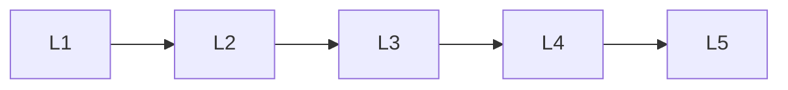

# Classification

> Deep lessons for **Classification** in the Machine Learning handbook.

## Lessons

| # | Lesson |
|---|--------|
| 1 | [Logistic Regression](01-logistic-regression.md) |
| 2 | [K-Nearest Neighbors](02-k-nearest-neighbors.md) |
| 3 | [Naive Bayes](03-naive-bayes.md) |
| 4 | [Support Vector Machines](04-support-vector-machines.md) |
| 5 | [Decision Trees](05-decision-trees.md) |

**Topic hub:** [../README.md](../README.md)
