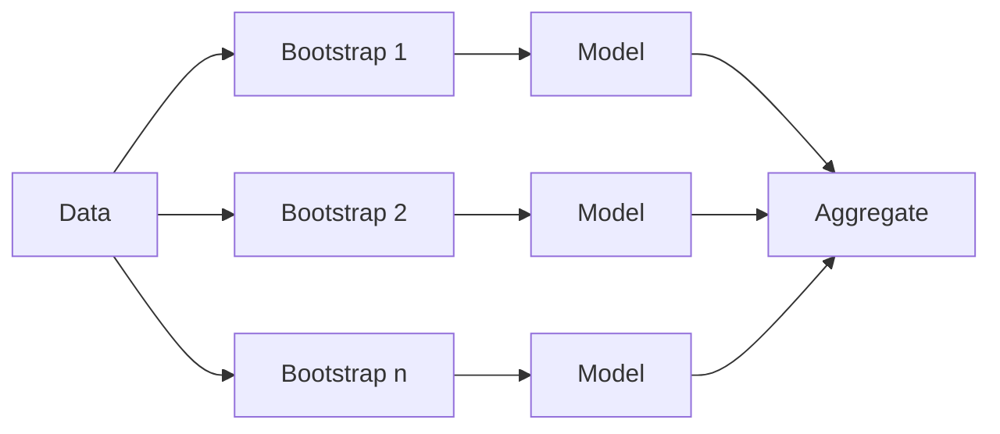

# 1. Bagging

> Bootstrap aggregating — average many models to cut variance.

## Definition

**Bagging** trains models on bootstrap samples of the data and aggregates predictions (vote / average). Reduces variance of unstable base learners (e.g. deep trees).

## Code

```python
from sklearn.ensemble import BaggingClassifier
from sklearn.tree import DecisionTreeClassifier

clf = BaggingClassifier(
    estimator=DecisionTreeClassifier(),
    n_estimators=50,
    random_state=42,
)
clf.fit(X_train, y_train)
```

## Intuition



---

## Continue

- **Section hub:** [Ensemble Learning](README.md)
- **ML overview:** [Machine Learning](../README.md)
