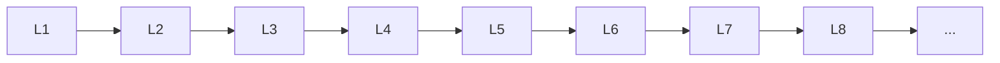

# Ensemble Learning

> Deep lessons for **Ensemble Learning** in the Machine Learning handbook.

## Lessons

| # | Lesson |
|---|--------|
| 1 | [Bagging](01-bagging.md) |
| 2 | [Random Forest](02-random-forest.md) |
| 3 | [Boosting](03-boosting.md) |
| 4 | [AdaBoost](04-adaboost.md) |
| 5 | [Gradient Boosting](05-gradient-boosting.md) |
| 6 | [XGBoost](06-xgboost.md) |
| 7 | [LightGBM](07-lightgbm.md) |
| 8 | [CatBoost](08-catboost.md) |
| 9 | [Stacking & Voting](09-stacking-and-voting.md) |

**Topic hub:** [../README.md](../README.md)
