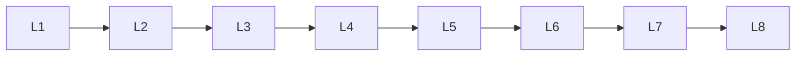

# Feature Engineering

> Deep lessons for **Feature Engineering** in the Machine Learning handbook.

## Lessons

| # | Lesson |
|---|--------|
| 1 | [Feature Scaling](01-feature-scaling.md) |
| 2 | [Feature Transformation](02-feature-transformation.md) |
| 3 | [Feature Selection](03-feature-selection.md) |
| 4 | [Feature Extraction](04-feature-extraction.md) |
| 5 | [Encoding Categorical Variables](05-encoding-categorical-variables.md) |
| 6 | [Handling Missing Values](06-handling-missing-values.md) |
| 7 | [Handling Outliers](07-handling-outliers.md) |
| 8 | [Imbalanced Data](08-imbalanced-data.md) |

**Topic hub:** [../README.md](../README.md)
