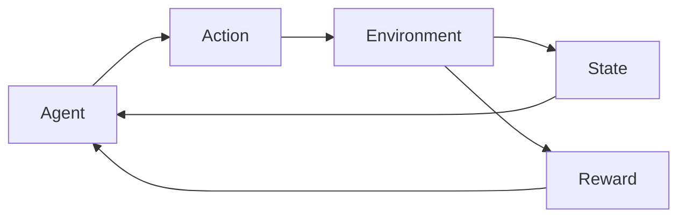

# 5. Reinforcement Learning Basics

> Agents, states, actions, rewards — the RL loop at a glance.

## Definition

**Reinforcement learning (RL)** learns a policy that maximizes expected cumulative reward through interaction with an environment.

## Core vocabulary

| Term | Meaning |
|------|---------|
| State | What the agent observes |
| Action | What it chooses |
| Reward | Scalar feedback |
| Policy | Mapping states → actions |
| Value / Q | Expected return |

## See also

- [AI Agents](../../ai-agents/README.md) · bandits as a simple RL cousin

---

## Continue

- **Section hub:** [Miscellaneous ML](README.md)
- **ML overview:** [Machine Learning](../README.md)
