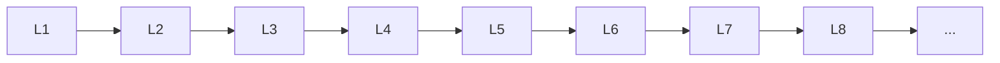

# Miscellaneous

> Deep lessons for **Miscellaneous** in the Machine Learning handbook.

## Lessons

| # | Lesson |
|---|--------|
| 1 | [Anomaly Detection](01-anomaly-detection.md) |
| 2 | [Recommendation Systems](02-recommendation-systems.md) |
| 3 | [Time Series](03-time-series.md) |
| 4 | [Semi-Supervised Learning](04-semi-supervised-learning.md) |
| 5 | [Reinforcement Learning Basics](05-reinforcement-learning-basics.md) |
| 6 | [Explainable AI](06-explainable-ai.md) |
| 7 | [Model Interpretability](07-model-interpretability.md) |
| 8 | [ML Pipelines](08-ml-pipelines.md) |
| 9 | [Scikit-Learn](09-scikit-learn.md) |

**Topic hub:** [../README.md](../README.md)
