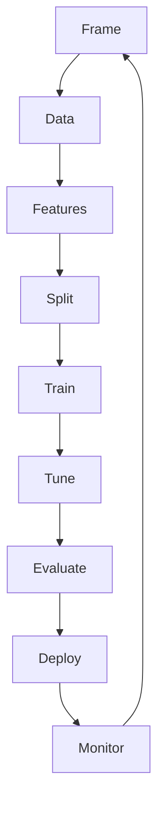

# 2. ML Workflow

> End-to-end loop from problem framing through deploy and monitor.

## Definition

The **ML workflow** is the repeatable path from business question to a monitored model in production.

## Stages

| Stage | Goal |
|-------|------|
| Frame | Define task, metric, success |
| Data | Collect, clean, label |
| Features | Represent inputs |
| Split | Train / val / test |
| Train | Fit model |
| Tune | Hyperparameters on val |
| Evaluate | Final test / offline metrics |
| Ship | Deploy + monitor drift |

## Uses in AI eng

- Offline eval harnesses for LLM apps mirror this loop  
- Same discipline for ranking, classifiers, and regressors  

## Common mistakes

- Tuning on the test set  
- No clear metric before modeling

---

## Continue

- **Section hub:** [ML Basics](README.md)
- **ML overview:** [Machine Learning](../README.md)
