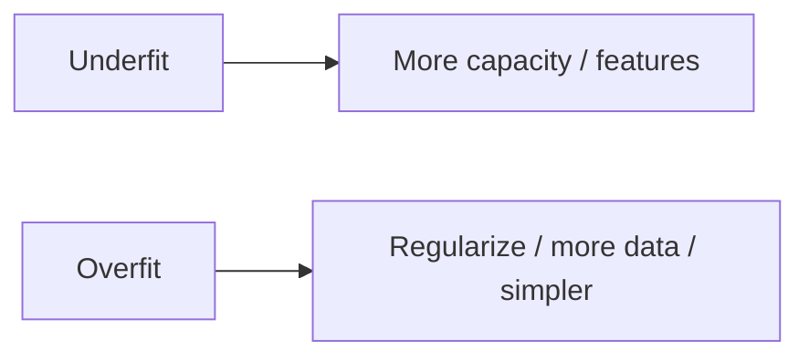

# 8. Overfitting & Underfitting

> Too complex vs too simple — reading train/val gaps.

## Definition

- **Overfitting** — memorizes train, fails on new data (high variance)  
- **Underfitting** — too simple for the pattern (high bias)

## Signals

| Pattern | Train | Val |
|---------|-------|-----|
| Underfit | High error | High error |
| Overfit | Low error | High error |
| Good fit | Low-ish | Similar low-ish |

## Fixes

- Overfit: more data, regularization, early stop, fewer features  
- Underfit: richer features, deeper trees, less regularization  

## See also

- [Bias-Variance Tradeoff](09-bias-variance-tradeoff.md)

---

## Continue

- **Section hub:** [ML Basics](README.md)
- **ML overview:** [Machine Learning](../README.md)
