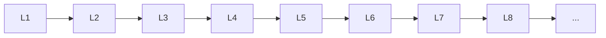

# Ml Basics

> Deep lessons for **Ml Basics** in the Machine Learning handbook.

## Lessons

| # | Lesson |
|---|--------|
| 1 | [Introduction to Machine Learning](01-introduction-to-machine-learning.md) |
| 2 | [ML Workflow](02-ml-workflow.md) |
| 3 | [Training, Validation & Testing](03-training-validation-testing.md) |
| 4 | [Features & Labels](04-features-and-labels.md) |
| 5 | [Model Parameters & Hyperparameters](05-parameters-and-hyperparameters.md) |
| 6 | [Loss Functions](06-loss-functions.md) |
| 7 | [Optimization](07-optimization.md) |
| 8 | [Overfitting & Underfitting](08-overfitting-and-underfitting.md) |
| 9 | [Bias-Variance Tradeoff](09-bias-variance-tradeoff.md) |

**Topic hub:** [../README.md](../README.md)
