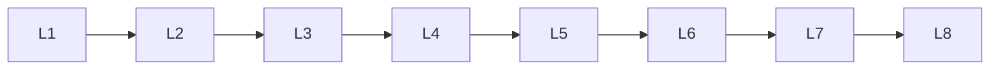

# Model Evaluation

> Deep lessons for **Model Evaluation** in the Machine Learning handbook.

## Lessons

| # | Lesson |
|---|--------|
| 1 | [Regression Metrics](01-regression-metrics.md) |
| 2 | [Classification Metrics](02-classification-metrics.md) |
| 3 | [Confusion Matrix](03-confusion-matrix.md) |
| 4 | [Precision & Recall](04-precision-and-recall.md) |
| 5 | [F1 Score](05-f1-score.md) |
| 6 | [ROC-AUC](06-roc-auc.md) |
| 7 | [Cross-Validation](07-cross-validation.md) |
| 8 | [Learning Curves](08-learning-curves.md) |

**Topic hub:** [../README.md](../README.md)
