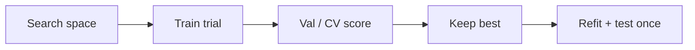

# 1. Hyperparameter Tuning

> Search model knobs on validation / CV — never on the final test set.

## Definition

**Hyperparameter tuning** selects non-learned settings (depth, C, lr, …) using validation performance.

## Loop

## See also

- [Grid Search](02-grid-search.md) · [Random Search](03-random-search.md) · [Bayesian Optimization](04-bayesian-optimization.md)

---

## Continue

- **Section hub:** [Model Optimization](README.md)
- **ML overview:** [Machine Learning](../README.md)
