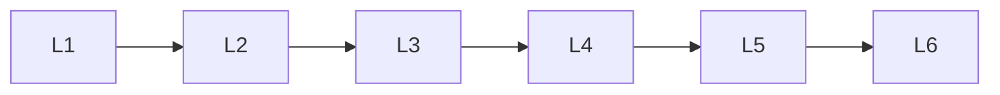

# Model Optimization

> Deep lessons for **Model Optimization** in the Machine Learning handbook.

## Lessons

| # | Lesson |
|---|--------|
| 1 | [Hyperparameter Tuning](01-hyperparameter-tuning.md) |
| 2 | [Grid Search](02-grid-search.md) |
| 3 | [Random Search](03-random-search.md) |
| 4 | [Bayesian Optimization](04-bayesian-optimization.md) |
| 5 | [Regularization](05-regularization.md) |
| 6 | [Early Stopping](06-early-stopping.md) |

**Topic hub:** [../README.md](../README.md)
