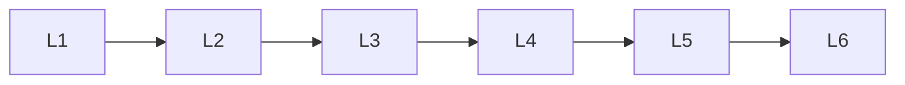

# Regression

> Deep lessons for **Regression** in the Machine Learning handbook.

## Lessons

| # | Lesson |
|---|--------|
| 1 | [Linear Regression](01-linear-regression.md) |
| 2 | [Multiple Linear Regression](02-multiple-linear-regression.md) |
| 3 | [Polynomial Regression](03-polynomial-regression.md) |
| 4 | [Ridge Regression](04-ridge-regression.md) |
| 5 | [Lasso Regression](05-lasso-regression.md) |
| 6 | [Elastic Net Regression](06-elastic-net-regression.md) |

**Topic hub:** [../README.md](../README.md)
