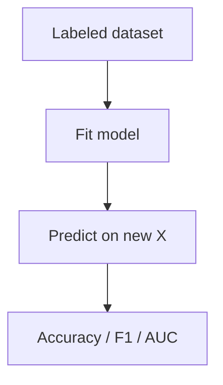

# Supervised Learning Essentials

> Labeled data, loss functions, and the models you should know before neural nets.

## Definition

**Supervised learning** trains on input–label pairs to predict labels for new inputs. Classification predicts categories; regression predicts continuous values. Common models: logistic regression, decision trees, random forests, gradient boosting.

## Why it matters

Many production 'AI' components are supervised models surrounding an LLM (routers, filters, rankers). Knowing these keeps systems simpler and cheaper.

## How it works

## Key principles

1. **Labels define the task** — Garbage labels → garbage model.
2. **Match model to data size** — Huge nets on tiny data overfit.
3. **Prefer interpretable baselines** — Debug features before ensembling.

## Common applications

| Application | Description |
|-------------|-------------|
| Intent classification | Support vs billing vs tech |
| Spam/toxicity filters | Binary classifiers |
| Score prediction | Regression for quality scores |

## Common mistakes

- Optimizing accuracy on imbalanced data
- Leaky features that encode the label

## Further reading

- [Train-eval discipline](train-eval-discipline.md)
- [Statistics for evaluation](../mathematics-statistics/statistics-for-evaluation.md)
