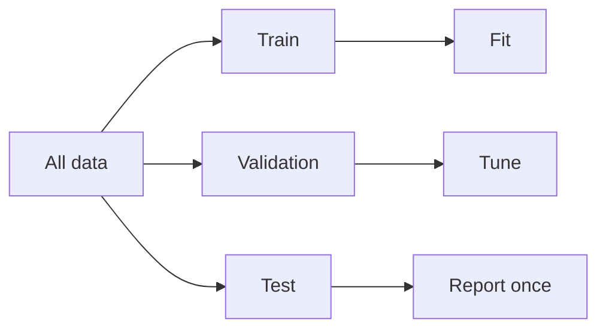

# Train–Eval Discipline

> How to split data, tune models, and avoid leakage — skills that transfer to LLM eval.

## Definition

Train/validation/test discipline prevents optimistic bias. You fit on train, select hyperparameters on validation, and report once on test. Cross-validation helps when data is limited.

## Why it matters

LLM golden sets and prompt A/B tests fail for the same reasons as classical ML when splits and leakage are ignored.

## How it works

## Key principles

1. **One-time test peek** — Repeated test tuning = overfitting the test set.
2. **Time-aware splits** — For logs, split by time not random rows.
3. **Track data lineage** — Know which examples influenced the model.

## Common applications

| Application | Description |
|-------------|-------------|
| Classical ML | sklearn pipelines |
| RAG eval | hold out documents/queries |
| Prompt eval | fixed golden sets in CI |

## Common mistakes

- Random split on duplicated near-identical rows
- Tuning prompts directly against the only eval set weekly

## Further reading

- [LLM Evaluation](../ai-evaluation/README.md)
- [ML mental model](ml-mental-model.md)
