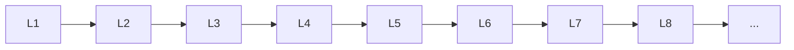

# Unsupervised Learning

> Deep lessons for **Unsupervised Learning** in the Machine Learning handbook.

## Lessons

| # | Lesson |
|---|--------|
| 1 | [Clustering](01-clustering.md) |
| 2 | [K-Means](02-k-means.md) |
| 3 | [Hierarchical Clustering](03-hierarchical-clustering.md) |
| 4 | [DBSCAN](04-dbscan.md) |
| 5 | [Gaussian Mixture Models](05-gaussian-mixture-models.md) |
| 6 | [Dimensionality Reduction](06-dimensionality-reduction.md) |
| 7 | [PCA](07-pca.md) |
| 8 | [t-SNE](08-t-sne.md) |
| 9 | [UMAP](09-umap.md) |

**Topic hub:** [../README.md](../README.md)
