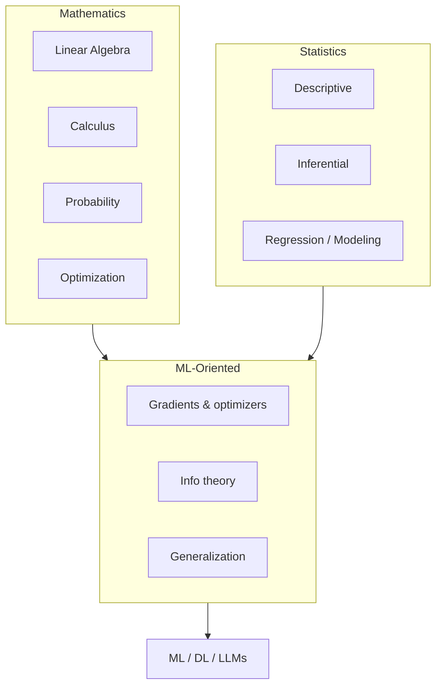

# Mathematics & Statistics

> Core math and statistics for AI engineering — foundations, inference, and the ML-oriented toolkit behind training and evaluation.

**Prerequisites:** None (start here if rusty)  
**Unlocks:** [Machine Learning](../machine-learning/README.md) · [Deep Learning](../deep-learning/README.md) · [Embeddings & Vector Databases](../embeddings-vector-databases/README.md)

Start with a section hub below (or expand **Math & Stats curriculum** in the left sidebar). Each topic page has definitions, key ideas, diagrams, and commented NumPy examples.

---

## Sections

| # | Section | What you will learn | Hub |
|---|---------|---------------------|-----|
| 1 | **Mathematics** | Linear algebra, calculus, DE, probability, discrete math, optimization, numerics | [mathematics/](mathematics/README.md) |
| 2 | **Statistics** | Descriptive/inferential stats, distributions, sampling, tests, regression, Bayes | [statistics/](statistics/README.md) |
| 3 | **ML-Oriented Mathematics** | LA/calc/prob/opt for ML, information theory, statistical learning theory | [ml-oriented/](ml-oriented/README.md) |

---

## Hierarchy

### 1. Mathematics

| # | Topic |
|---|-------|
| 1 | [Linear Algebra](mathematics/01-linear-algebra.md) |
| 2 | [Calculus](mathematics/02-calculus.md) |
| 3 | [Differential Equations](mathematics/03-differential-equations.md) |
| 4 | [Probability Theory](mathematics/04-probability-theory.md) |
| 5 | [Discrete Mathematics](mathematics/05-discrete-mathematics.md) |
| 6 | [Optimization](mathematics/06-optimization.md) |
| 7 | [Numerical Methods](mathematics/07-numerical-methods.md) |

### 2. Statistics

| # | Topic |
|---|-------|
| 8 | [Descriptive Statistics](statistics/08-descriptive-statistics.md) |
| 9 | [Inferential Statistics](statistics/09-inferential-statistics.md) |
| 10 | [Probability Distributions](statistics/10-probability-distributions.md) |
| 11 | [Sampling](statistics/11-sampling.md) |
| 12 | [Hypothesis Testing](statistics/12-hypothesis-testing.md) |
| 13 | [Confidence Intervals](statistics/13-confidence-intervals.md) |
| 14 | [Correlation & Covariance](statistics/14-correlation-covariance.md) |
| 15 | [Regression Analysis](statistics/15-regression-analysis.md) |
| 16 | [Bayesian Statistics](statistics/16-bayesian-statistics.md) |
| 17 | [Multivariate Statistics](statistics/17-multivariate-statistics.md) |
| 18 | [Statistical Modeling](statistics/18-statistical-modeling.md) |

### 3. ML-Oriented Mathematics

| # | Topic |
|---|-------|
| 19 | [Linear Algebra for ML](ml-oriented/19-linear-algebra-for-ml.md) |
| 20 | [Calculus for ML](ml-oriented/20-calculus-for-ml.md) |
| 21 | [Probability for ML](ml-oriented/21-probability-for-ml.md) |
| 22 | [Optimization for ML](ml-oriented/22-optimization-for-ml.md) |
| 23 | [Information Theory](ml-oriented/23-information-theory.md) |
| 24 | [Statistical Learning Theory](ml-oriented/24-statistical-learning-theory.md) |

---

## Definition

**Mathematics & statistics for AI** is the applied toolkit behind models: vectors and matrices (embeddings, attention), calculus and optimization (training), probability (uncertainty, sampling), and statistics (metrics, experiments, confidence). You do not need research-level proofs — you need intuition that guides engineering decisions.

---

## Learning path

| Stage | Topics | Focus |
|-------|--------|-------|
| Foundations | 1–7 | Core math used across ML systems |
| Statistics | 8–18 | Summarize data, infer, test, model |
| ML-oriented | 19–24 | Gradients, losses, info theory, generalization |

---

## Reference notes (shorter overviews)

| Note | Document |
|------|----------|
| Linear algebra essentials | [linear-algebra-essentials.md](linear-algebra-essentials.md) |
| Probability for ML | [probability-for-ml.md](probability-for-ml.md) |
| Statistics for evaluation | [statistics-for-evaluation.md](statistics-for-evaluation.md) |

---

## Related topics

- [Machine Learning](../machine-learning/README.md)
- [Deep Learning](../deep-learning/README.md)
- [LLM Evaluation](../ai-evaluation/README.md)
- [Python Frameworks & Libraries](../python-frameworks-libraries/README.md) (NumPy practice)

---

## See also

- [Domains overview](../README.md)
- [Learning Roadmap](../../meta/roadmap.md)
- [Master Index](../../meta/indexes/MASTER-INDEX.md)
