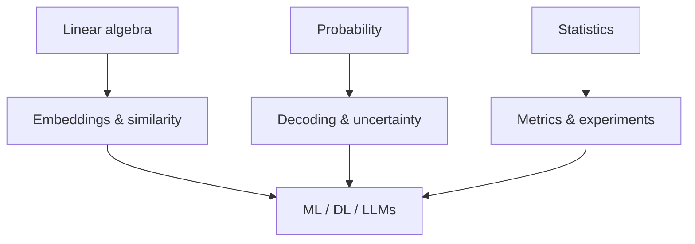

# Mathematics & Statistics

> The math you actually use in ML and LLM systems — linear algebra, probability, and evaluation statistics.

**Prerequisites:** None (start here if rusty)  
**Unlocks:** [Machine Learning](../machine-learning/README.md) · [Embeddings & Vector Databases](../embeddings-vector-databases/README.md)

---

## Definition

**Mathematics & statistics for AI** means the applied toolkit behind models: vectors/matrices (embeddings, attention), probability (sampling, uncertainty), and stats (metrics, A/B tests, confidence). You do not need research-level proofs — you need intuition that guides engineering decisions.

---

## Learning path

---

## Documents

| # | Topic | Document |
|---|-------|----------|
| 1 | Linear algebra essentials | [linear-algebra-essentials.md](linear-algebra-essentials.md) |
| 2 | Probability for ML | [probability-for-ml.md](probability-for-ml.md) |
| 3 | Statistics for evaluation | [statistics-for-evaluation.md](statistics-for-evaluation.md) |

---

## Related topics

- [Machine Learning](../machine-learning/README.md)
- [Deep Learning](../deep-learning/README.md)
- [LLM Evaluation](../ai-evaluation/README.md)

---

## See also

- [Domains overview](../README.md)
- [Learning Roadmap](../../meta/roadmap.md)
- [Master Index](../../meta/indexes/MASTER-INDEX.md)
