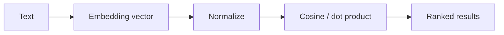

# Linear Algebra Essentials

> Vectors, matrices, and similarity — the language of embeddings and neural nets.

## Definition

Linear algebra studies vectors and linear transforms. In AI, almost everything is a vector: token embeddings, hidden states, and document representations. Similarity (dot product / cosine) is how models and retrieval systems compare meaning.

## Why it matters

Without vector intuition, embeddings, attention, and PCA feel like magic. With it, you can debug retrieval quality, dimensionality, and normalization issues.

## How it works

## Key principles

1. **Think in spaces** — Similar meanings cluster in vector space.
2. **Normalize for cosine** — Cosine similarity ignores magnitude; often desirable for text.
3. **Dimensionality is a tradeoff** — Higher dims can express more, but cost more storage/compute.

## Common applications

| Application | Description |
|-------------|-------------|
| Vector search | Nearest neighbors in embedding space |
| Attention | Weighted combinations of value vectors |
| PCA / SVD | Compress and inspect representations |

## Common mistakes

- Comparing unnormalized vectors with cosine assumptions mismatched
- Ignoring that different embedding models live in incompatible spaces

## Further reading

- [Embeddings & Vector Databases](../embeddings-vector-databases/README.md)
- [Transformers](../transformers/README.md)
