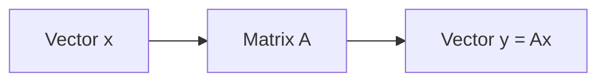

# 1. Linear Algebra

> Vectors, matrices, linear maps, and spaces — the language of embeddings and neural nets.

## Definition

**Linear algebra** studies vectors, matrices, and linear transformations. In AI it is the language of embeddings, attention, PCA, and layer computations.

## Core objects

| Object | Meaning |
|--------|---------|
| Vector | Ordered list of numbers (point/direction) |
| Matrix | Linear map / table of numbers |
| Scalar | Single number |
| Tensor (informal) | Multi-way array (NumPy/PyTorch) |

## Key ideas

1. **Linear combination** — weighted sum of vectors  
2. **Span / basis** — what directions a set can reach  
3. **Dot product** — similarity / projection  
4. **Matrix multiply** — compose linear maps  
5. **Rank, inverse, eigenvalues** — structure of a map  

## How it works



## Code (NumPy)

```python
import numpy as np

v = np.array([1.0, 2.0, 3.0])
w = np.array([0.0, 1.0, 0.5])
print(np.dot(v, w))              # similarity / projection

A = np.array([[1.0, 0.0], [2.0, 3.0]])
x = np.array([1.0, 1.0])
print(A @ x)                     # matrix-vector product

# Cosine similarity
cos = (v @ w) / (np.linalg.norm(v) * np.linalg.norm(w) + 1e-12)
print(cos)
```

## Uses in AI

| Application | How linear algebra shows up |
|-------------|-----------------------------|
| Embeddings | Vectors in R^d |
| Attention | QK^T scores, weighted V |
| PCA / SVD | Compress representations |
| Dense layers | y = Wx + b |

## Common mistakes

- Mixing row vs column conventions without care  
- Using Euclidean distance on unnormalized embeddings when cosine was intended  
- Assuming every square matrix is invertible  

## See also

- [19. Linear Algebra for ML](../ml-oriented/19-linear-algebra-for-ml.md)  
- [NumPy linear algebra](../../python-frameworks-libraries/numpy/08-linear-algebra.md)

---

## Continue

- **Section hub:** [Mathematics](README.md)
- **Math & Stats overview:** [Mathematics & Statistics](../README.md)
- Next topic: use the numbered list on the hub
