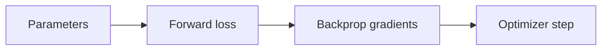

# 2. Calculus

> Derivatives, gradients, and integrals — how models learn from loss.

## Definition

**Calculus** studies change (derivatives) and accumulation (integrals). ML mainly needs **differential calculus**: gradients of loss functions with respect to parameters.

## Core ideas

| Idea | Meaning |
|------|---------|
| Derivative | Instantaneous rate of change |
| Partial derivative | Derivative w.r.t. one variable |
| Gradient | Vector of all partials |
| Chain rule | Derivative of compositions |
| Integral | Area / accumulation (less central day-to-day) |

## How gradients work



## Key formulas (intuition)

- Scalar: f'(x) ≈ slope  
- Multivariate: ∇f points to steepest ascent  
- Chain rule: dL/dw = dL/dy · dy/dw  

## Code (finite difference check)

```python
import numpy as np

def f(x):
    return x**2 + 3 * x

def numerical_grad(fn, x, eps=1e-5):
    return (fn(x + eps) - fn(x - eps)) / (2 * eps)

x = 2.0
print("analytical", 2 * x + 3)
print("numerical ", numerical_grad(f, x))
```

## Uses in AI

- Backpropagation through neural nets  
- Understanding learning rate / curvature  
- Continuous relaxation of discrete choices  

## Common mistakes

- Confusing gradient (ascent) with descent direction (−∇)  
- Ignoring that step size interacts with gradient scale  

## See also

- [20. Calculus for ML](../ml-oriented/20-calculus-for-ml.md)

---

## Continue

- **Section hub:** [Mathematics](README.md)
- **Math & Stats overview:** [Mathematics & Statistics](../README.md)
- Next topic: use the numbered list on the hub
