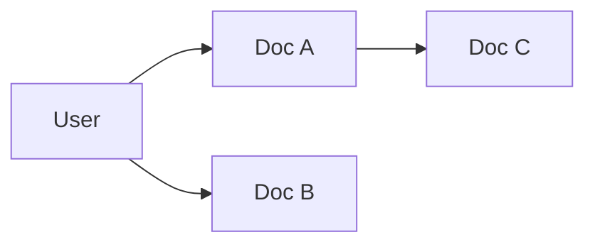

# 5. Discrete Mathematics

> Logic, sets, graphs, and combinatorics — discrete structures behind algorithms and data.

## Definition

**Discrete mathematics** studies countable structures: sets, logic, relations, graphs, and counting — the backbone of algorithms, data structures, and many ML discrete choices.

## Core areas

| Area | Meaning |
|------|---------|
| Sets & logic | Membership, ∧ ∨ ¬, quantifiers |
| Relations / functions | Mappings, equivalence |
| Combinatorics | Counting, permutations |
| Graph theory | Nodes/edges, paths |
| Recurrence | Discrete sequences |

## Graphs (high value for AI)



## Code (adjacency sketch)

```python
# Undirected graph as adjacency list
g = {
    "query": ["d1", "d2"],
    "d1": ["query", "d3"],
    "d2": ["query"],
    "d3": ["d1"],
}
print(sorted(g["query"]))
```

## Uses in AI

- Token vocabularies & discrete symbols  
- Knowledge graphs / citation graphs  
- Beam search combinatorial choices  
- Attention as soft relations on discrete tokens  

## Common mistakes

- Ignoring combinatorial explosion (search spaces)  
- Using continuous intuition where discrete constraints dominate  

## See also

- [6. Optimization](06-optimization.md) (discrete vs continuous)

---

## Continue

- **Section hub:** [Mathematics](README.md)
- **Math & Stats overview:** [Mathematics & Statistics](../README.md)
- Next topic: use the numbered list on the hub
