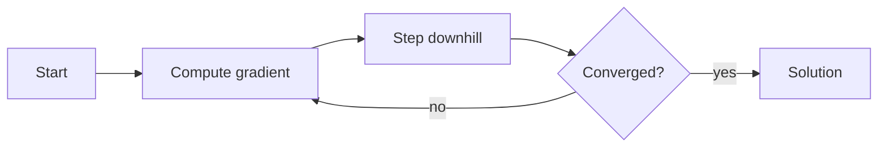

# 6. Optimization

> Finding best parameters — objectives, constraints, convexity, and iterative methods.

## Definition

**Optimization** means finding a parameter vector that minimizes (or maximizes) an objective. Training a model is optimization of a loss over parameters.

## Core vocabulary

| Term | Meaning |
|------|---------|
| Objective / loss | Function to minimize |
| Constraints | Feasible set |
| Local vs global min | Landscape shape |
| Convex | Local = global (nice case) |
| Gradient descent | Iterate x ← x − η∇f(x) |
| Learning rate η | Step size |

## Gradient descent



## Code

```python
import numpy as np

def f(x):
    return (x - 3) ** 2

def grad(x):
    return 2 * (x - 3)

x = 0.0
for _ in range(50):
    x = x - 0.1 * grad(x)
print(x, f(x))
```

## Uses in AI

- Model training (SGD, Adam)  
- Hyperparameter search  
- Decoding objectives / RL rewards  

## Common mistakes

- Too large learning rate → diverge  
- Assuming non-convex nets have unique minima  

## See also

- [22. Optimization for ML](../ml-oriented/22-optimization-for-ml.md)  
- [7. Numerical Methods](07-numerical-methods.md)

---

## Continue

- **Section hub:** [Mathematics](README.md)
- **Math & Stats overview:** [Mathematics & Statistics](../README.md)
- Next topic: use the numbered list on the hub
