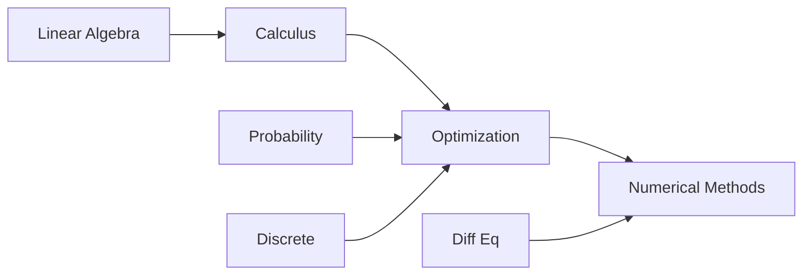

# Mathematics

> Core mathematical foundations for AI engineering — linear algebra through numerical methods.

**Parent:** [Mathematics & Statistics](../README.md)

---

## Topics

| # | Topic | Document |
|---|-------|----------|
| 1 | Linear Algebra | [01-linear-algebra.md](01-linear-algebra.md) |
| 2 | Calculus | [02-calculus.md](02-calculus.md) |
| 3 | Differential Equations | [03-differential-equations.md](03-differential-equations.md) |
| 4 | Probability Theory | [04-probability-theory.md](04-probability-theory.md) |
| 5 | Discrete Mathematics | [05-discrete-mathematics.md](05-discrete-mathematics.md) |
| 6 | Optimization | [06-optimization.md](06-optimization.md) |
| 7 | Numerical Methods | [07-numerical-methods.md](07-numerical-methods.md) |

