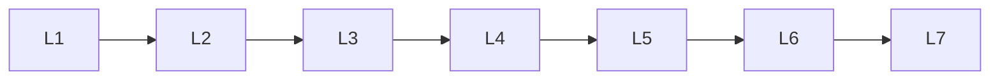

# Mathematics

> Deep lessons for **Mathematics** in the Mathematics & Statistics handbook.

## Lessons

| # | Lesson |
|---|--------|
| 1 | [Linear Algebra](01-linear-algebra.md) |
| 2 | [Calculus](02-calculus.md) |
| 3 | [Differential Equations](03-differential-equations.md) |
| 4 | [Probability Theory](04-probability-theory.md) |
| 5 | [Discrete Mathematics](05-discrete-mathematics.md) |
| 6 | [Optimization](06-optimization.md) |
| 7 | [Numerical Methods](07-numerical-methods.md) |

**Topic hub:** [../README.md](../README.md)
