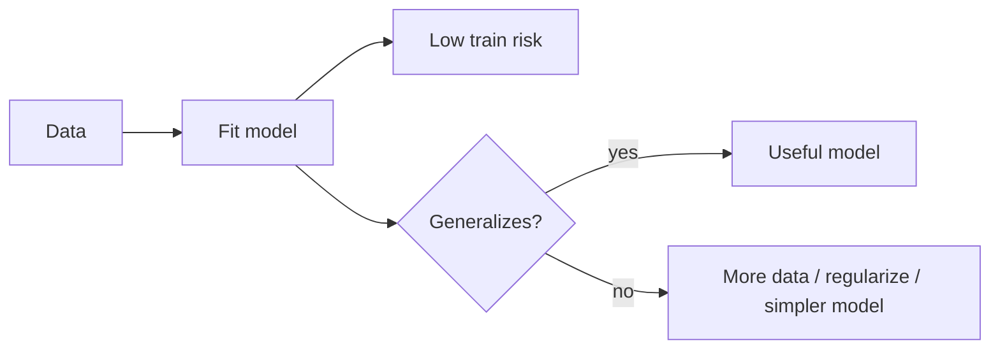

# 24. Statistical Learning Theory

> Generalization — bias–variance, VC intuition, and why more data / regularization helps.

## Definition

**Statistical learning theory** studies when a model learned from a sample will generalize to new data: capacity, complexity, and risk.

## Key ideas

| Idea | Meaning |
|------|---------|
| Empirical risk | Training loss |
| True risk | Expected loss on population |
| Generalization gap | True − empirical risk |
| Bias–variance | Under/overfitting tradeoff |
| Capacity / VC (intuition) | How flexible the hypothesis class is |
| Regularization | Constrain capacity |

## Flow



## Code (train vs test error sketch)

```python
import numpy as np

rng = np.random.default_rng(0)
# poly features of increasing degree → overfit tiny data
x = np.linspace(-1, 1, 12)
y = np.sin(2 * np.pi * x) + rng.normal(0, 0.15, size=len(x))
x_te = np.linspace(-1, 1, 100)
y_te = np.sin(2 * np.pi * x_te)

for deg in [1, 3, 9]:
    coef = np.polyfit(x, y, deg)
    tr = np.mean((np.polyval(coef, x) - y) ** 2)
    te = np.mean((np.polyval(coef, x_te) - y_te) ** 2)
    print(deg, "train", round(tr, 4), "test", round(te, 4))
```

## Uses

- Choose model complexity  
- Interpret overfitting in deep nets  
- Design validation / early stopping  

## See also

- [18. Statistical Modeling](../statistics/18-statistical-modeling.md) · [Machine Learning](../../machine-learning/README.md)

---

## Continue

- **Section hub:** [ML-Oriented Mathematics](README.md)
- **Math & Stats overview:** [Mathematics & Statistics](../README.md)
