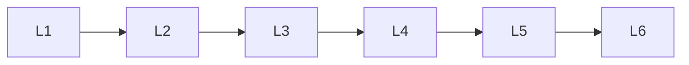

# Ml Oriented

> Deep lessons for **Ml Oriented** in the Mathematics & Statistics handbook.

## Lessons

| # | Lesson |
|---|--------|
| 1 | [Linear Algebra for ML](19-linear-algebra-for-ml.md) |
| 2 | [Calculus for ML](20-calculus-for-ml.md) |
| 3 | [Probability for ML](21-probability-for-ml.md) |
| 4 | [Optimization for ML](22-optimization-for-ml.md) |
| 5 | [Information Theory](23-information-theory.md) |
| 6 | [Statistical Learning Theory](24-statistical-learning-theory.md) |

**Topic hub:** [../README.md](../README.md)
