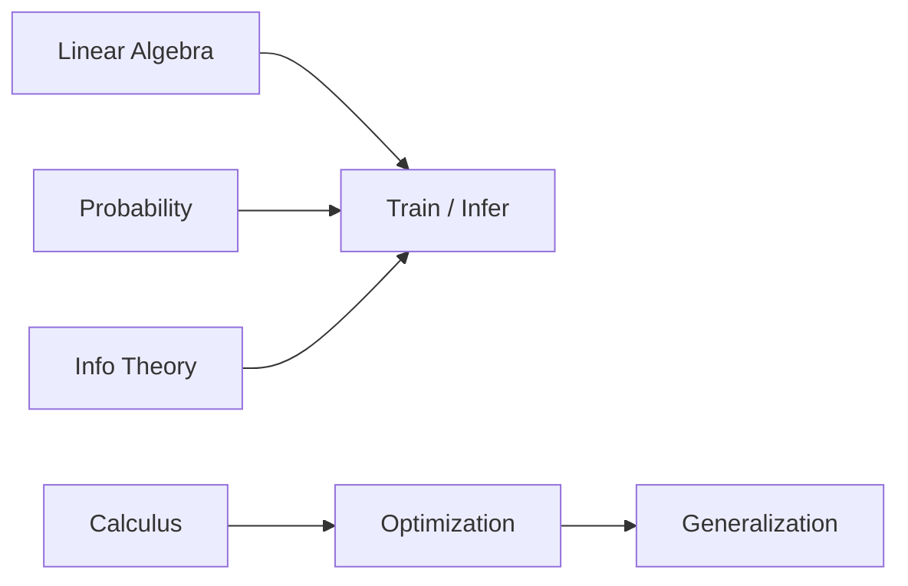

# ML-Oriented Mathematics

> The math most used when building, training, and evaluating machine learning systems.

**Parent:** [Mathematics & Statistics](../README.md)

---

## Topics

| # | Topic | Document |
|---|-------|----------|
| 19 | Linear Algebra for ML | [19-linear-algebra-for-ml.md](19-linear-algebra-for-ml.md) |
| 20 | Calculus for ML | [20-calculus-for-ml.md](20-calculus-for-ml.md) |
| 21 | Probability for ML | [21-probability-for-ml.md](21-probability-for-ml.md) |
| 22 | Optimization for ML | [22-optimization-for-ml.md](22-optimization-for-ml.md) |
| 23 | Information Theory | [23-information-theory.md](23-information-theory.md) |
| 24 | Statistical Learning Theory | [24-statistical-learning-theory.md](24-statistical-learning-theory.md) |

