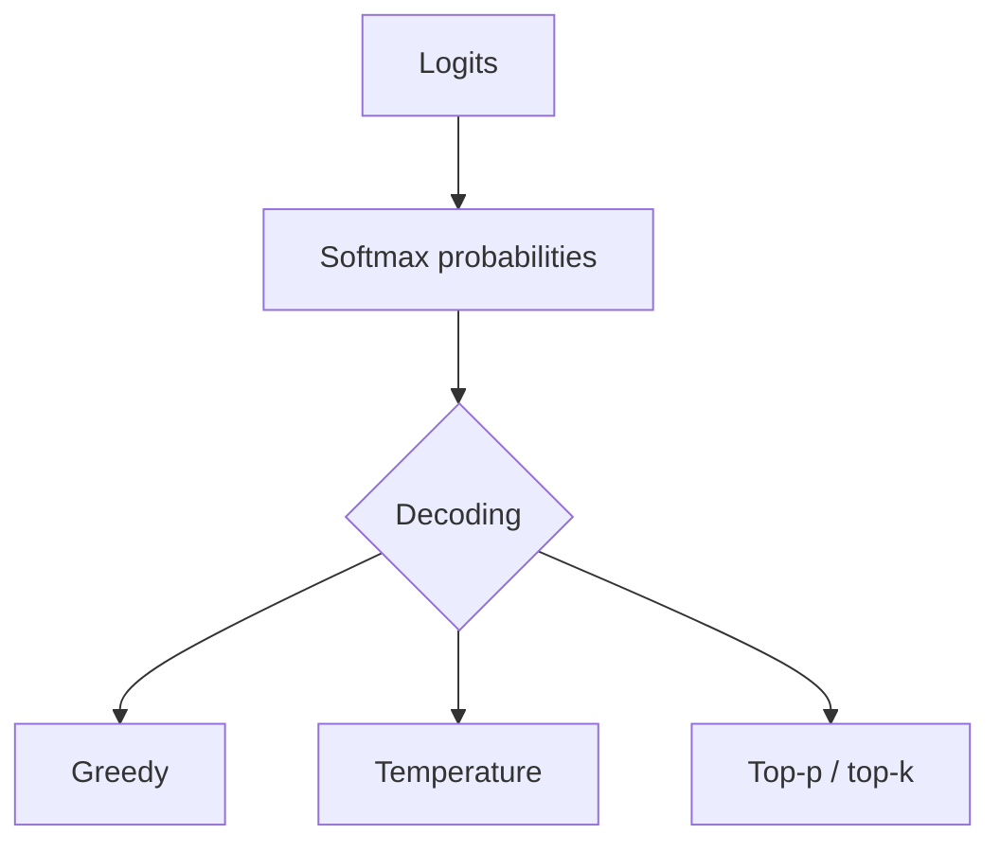

# Probability for Machine Learning

> Distributions, likelihood, and sampling — how models express uncertainty.

## Definition

Probability quantifies uncertainty. ML models often output distributions (class probabilities, next-token distributions). Sampling strategies (greedy, temperature, top-p) control how we draw from those distributions.

## Why it matters

LLM decoding, calibration, and risk decisions all depend on probability literacy. Temperature and top-p are not cosmetic — they change the sampling distribution.

## How it works

## Key principles

1. **Outputs are distributions** — Treat probabilities as beliefs, not destiny.
2. **Temperature reshapes mass** — Higher temperature flattens; lower sharpens.
3. **Calibration matters** — A 0.9 score should be right ~90% of the time for that bucket.

## Common applications

| Application | Description |
|-------------|-------------|
| LLM decoding | Choose sampling for creativity vs precision |
| Classification thresholds | Trade precision/recall |
| Risk scoring | Abstain when uncertain |

## Common mistakes

- Using temperature to 'fix' factual errors
- Comparing probabilities across differently calibrated models

## Further reading

- [Large Language Models](../llm-engineering/README.md)
- [Statistics for evaluation](statistics-for-evaluation.md)
