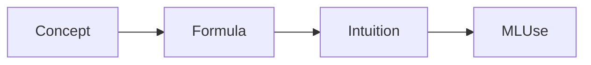

# Statistics for Evaluation

> How to measure model quality without fooling yourself — metrics, variance, and experiments.

## Table of Contents

- [Overview](#overview)
- [Definition](#definition)
- [Why It Matters](#why-it-matters)
- [Uses](#uses)
- [Core Ideas](#core-ideas)
- [How It Works](#how-it-works)
- [Worked Example](#worked-example)
- [Python Examples](#python-examples)
- [Practice Exercises](#practice-exercises)
- [Evaluation](#evaluation)
- [Production Considerations](#production-considerations)
- [Performance & Cost](#performance--cost)
- [Common Failure Modes](#common-failure-modes)
- [Best Practices](#best-practices)
- [Common Mistakes](#common-mistakes)
- [Interview Preparation](#interview-preparation)
- [Navigation](#navigation)

---

## Overview

This lesson belongs to **Overview** in the **Mathematics & Statistics** handbook. Goal: understand **Statistics for Evaluation** well enough to implement, measure, and explain it in a design review.

**Typical workflow:** definition → intuition → formula → ML/DL connection.

---

## Definition

**Statistics for Evaluation** — How to measure model quality without fooling yourself — metrics, variance, and experiments.

Be able to state inputs, outputs, assumptions, and the metric that proves success.

---

## Why It Matters

Skipping statistics for evaluation creates fragile systems: wrong preprocessing, silent metric lies, or APIs used without understanding failure modes. This topic is foundational for later LLM/RAG/agent work.

---

## Uses

| Use case | How this applies |
|----------|------------------|
| Learning path | Build intuition before heavier models |
| Baseline | Ship a correct simple version first |
| Production | Meet quality/latency with known knobs |
| Debugging | Separate data vs model vs eval bugs |

---

## Core Ideas

1. Write the task contract before choosing tools.
2. Prefer simple baselines; add complexity only for measured gains.
3. Keep train/eval protocols leakage-free.
4. Log seeds, versions, and metrics for reproducibility.
5. Optimize the metric that matches real error cost.

---

## How It Works



Connect each node to code you own: data, transform/model, evaluation, and serving/config.

---

## Worked Example

**Scenario:** Apply **Statistics for Evaluation** on a small real dataset or API workload.

1. Define success metric and constraints (latency, memory, interpretability).
2. Implement the minimal version end-to-end.
3. Measure on a held-out set / golden prompts.
4. Error-analyze failures; fix data/config before model hopping.
5. Document limits and rollback.

**Exit criteria:** metric on holdout ≥ target, and behavior under failure is explicit.

---

## Python Examples

```python
import math

def softmax(xs: list[float]) -> list[float]:
    m = max(xs)
    exps = [math.exp(x - m) for x in xs]
    s = sum(exps) or 1.0
    return [e / s for e in exps]

def mean(xs: list[float]) -> float:
    return sum(xs) / max(1, len(xs))

```

Adapt the snippet to the library or model discussed in this lesson; keep experiments scriptable.

---

## Practice Exercises

1. Re-implement the core idea in <50 lines and test on 3 examples.
2. Break it on purpose (bad split, wrong hyperparameter) and observe the symptom.
3. Write a 5-bullet model/method card: intent, data, metric, limits, next experiment.

---

## Evaluation

| Layer | What to check |
|-------|----------------|
| Correctness | Unit tests / toy examples |
| Holdout quality | Primary metric + slices |
| Robustness | Noisy inputs, distribution shift |
| Ops | Latency, memory, cost envelopes |

---

## Production Considerations

- Version code + artifacts + configs together.
- Monitor drift and quality regressions.
- Feature-flag risky changes; keep rollback pins.
- Document expected failure behavior for callers.

## Performance & Cost

- Profile before micro-optimizing.
- Cache stable intermediates when safe.
- Prefer cheaper methods when utility is flat.

---

## Common Failure Modes

- Leakage and optimistic offline scores.
- Metric mismatch with product goals.
- Train/serve skew in preprocessing.
- Ignoring rare but costly error slices.

---

## Best Practices

1. Baseline → diagnose → complicate.
2. Keep tiny fixtures for transforms/tokenizers.
3. Record assumptions in a short method card.
4. Prefer diagnostics you can explain (confusion matrix, residual plots, traces).
5. Re-eval when data or dependencies change.

---

## Common Mistakes

- Memorizing APIs without the task contract.
- Tuning on the test set.
- One lucky seed as “proof”.
- Shipping without monitoring hooks.

---

## Interview Preparation

**Q: Explain statistics for evaluation to a senior engineer in two minutes.**

A: Definition → when to use → core mechanism → metric → main failure mode → production knob.

**Q: How do you validate an implementation?**

A: Toy cases, holdout metric, slice checks, and a reproduction command with pinned versions.

**Q: What breaks in production first?**

A: Usually data/schema drift or train/serve preprocessing skew — not the math itself.

---

## Navigation

- **Topic hub:** [README](README.md)
