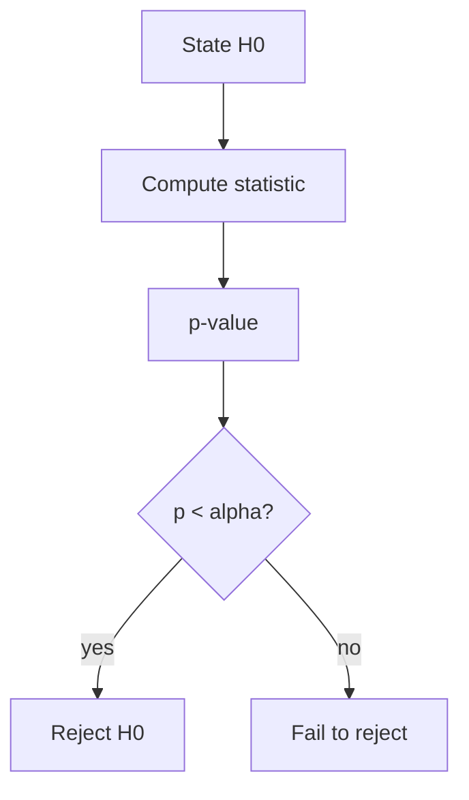

# 12. Hypothesis Testing

> Null vs alternative — p-values, errors, and deciding if a difference is real.

## Definition

**Hypothesis testing** asks whether data are surprising under a null hypothesis H0. We compute a test statistic and a **p-value** (probability of data as extreme as observed if H0 were true).

## Core vocabulary

| Term | Meaning |
|------|---------|
| H0 / H1 | Null / alternative |
| p-value | Surprise under H0 |
| Significance α | False positive rate target |
| Type I error | Reject true H0 |
| Type II error | Miss real effect |
| Power | 1 − Type II |

## Flow



## Code (two-proportion intuition)

```python
import numpy as np
from math import sqrt

def two_prop_z(s1, n1, s2, n2):
    p1, p2 = s1 / n1, s2 / n2
    p = (s1 + s2) / (n1 + n2)
    se = sqrt(p * (1 - p) * (1/n1 + 1/n2))
    return (p1 - p2) / se

z = two_prop_z(60, 100, 50, 100)
print("z", z)
```

## Uses

- A/B tests on click or task success  
- Comparing model win rates  
- Offline metric deltas  

## Common mistakes

- p-hacking / many tests without correction  
- Concluding "no difference" from failure to reject  
- Tiny n with huge claims  

## See also

- [13. Confidence Intervals](13-confidence-intervals.md)

---

## Continue

- **Section hub:** [Statistics](README.md)
- **Math & Stats overview:** [Mathematics & Statistics](../README.md)
