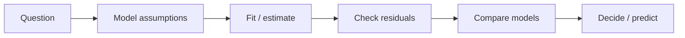

# 18. Statistical Modeling

> Building models that explain data — assumptions, likelihood, and model comparison.

## Definition

**Statistical modeling** constructs a probabilistic story for how data are generated, estimates parameters, checks assumptions, and compares models.

## Modeling loop



## Key ideas

| Idea | Meaning |
|------|---------|
| Generative story | How data arise |
| Likelihood | Fit measure |
| AIC/BIC / CV | Model comparison |
| Misspecification | Wrong assumptions |
| Parsimony | Prefer simpler adequate models |

## Code (Bernoulli MLE)

```python
import numpy as np

# MLE for Bernoulli p is sample mean
x = np.array([1, 1, 0, 1, 0, 1, 1, 0, 1, 1])
p_hat = x.mean()
ll = np.sum(x * np.log(p_hat) + (1 - x) * np.log(1 - p_hat))
print("p_hat", p_hat, "loglik", ll)
```

## Uses

- Choose metrics tied to a data model  
- Build interpretable baselines  
- Diagnose when ML models fail assumptions  

## See also

- [15. Regression Analysis](15-regression-analysis.md) · [24. Statistical Learning Theory](../ml-oriented/24-statistical-learning-theory.md)

---

## Continue

- **Section hub:** [Statistics](README.md)
- **Math & Stats overview:** [Mathematics & Statistics](../README.md)
