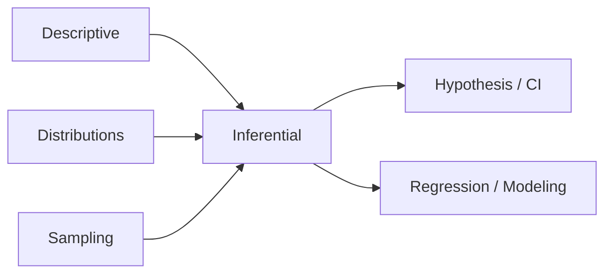

# Statistics

> Descriptive and inferential statistics for analyzing data, experiments, and model evaluation.

**Parent:** [Mathematics & Statistics](../README.md)

---

## Topics

| # | Topic | Document |
|---|-------|----------|
| 8 | Descriptive Statistics | [08-descriptive-statistics.md](08-descriptive-statistics.md) |
| 9 | Inferential Statistics | [09-inferential-statistics.md](09-inferential-statistics.md) |
| 10 | Probability Distributions | [10-probability-distributions.md](10-probability-distributions.md) |
| 11 | Sampling | [11-sampling.md](11-sampling.md) |
| 12 | Hypothesis Testing | [12-hypothesis-testing.md](12-hypothesis-testing.md) |
| 13 | Confidence Intervals | [13-confidence-intervals.md](13-confidence-intervals.md) |
| 14 | Correlation & Covariance | [14-correlation-covariance.md](14-correlation-covariance.md) |
| 15 | Regression Analysis | [15-regression-analysis.md](15-regression-analysis.md) |
| 16 | Bayesian Statistics | [16-bayesian-statistics.md](16-bayesian-statistics.md) |
| 17 | Multivariate Statistics | [17-multivariate-statistics.md](17-multivariate-statistics.md) |
| 18 | Statistical Modeling | [18-statistical-modeling.md](18-statistical-modeling.md) |

