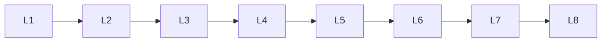

# Statistics

> Deep lessons for **Statistics** in the Mathematics & Statistics handbook.

## Lessons

| # | Lesson |
|---|--------|
| 1 | [Descriptive Statistics](08-descriptive-statistics.md) |
| 2 | [Inferential Statistics](09-inferential-statistics.md) |
| 3 | [Probability Distributions](10-probability-distributions.md) |
| 4 | [Sampling](11-sampling.md) |
| 5 | [Hypothesis Testing](12-hypothesis-testing.md) |
| 6 | [Confidence Intervals](13-confidence-intervals.md) |
| 7 | [Correlation & Covariance](14-correlation-covariance.md) |
| 8 | [Regression Analysis](15-regression-analysis.md) |
| 9 | [Bayesian Statistics](16-bayesian-statistics.md) |
| 10 | [Multivariate Statistics](17-multivariate-statistics.md) |
| 11 | [Statistical Modeling](18-statistical-modeling.md) |

**Topic hub:** [../README.md](../README.md)
