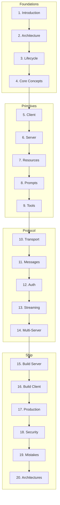

# Phase 9: Model Context Protocol (MCP) & AI Protocol Engineering

> Production-grade handbook for designing, implementing, securing, and scaling MCP systems.
> **Prerequisites:** [Phase 8 AI Agents](../ai-agents/README.md) · [Tool Use](../ai-agents/tool-use.md) · [LLM Tool Calling](../llm-engineering/llm-tool-calling.md)

---

## Module Overview

MCP is a **protocol specification** — not another REST API. It standardizes how AI hosts discover and invoke tools, resources, and prompts across transports.

**Unlocks:** [A2A](../a2a/README.md) · Enterprise AI platforms · Multi-agent ecosystems

---

## Documents (20 Sections)

| # | Topic | Document |
|---|-------|----------|
| 1 | Introduction | [introduction-to-mcp.md](introduction-to-mcp.md) |
| 2 | Architecture | [mcp-architecture.md](mcp-architecture.md) |
| 3 | Lifecycle | [mcp-lifecycle.md](mcp-lifecycle.md) |
| 4 | Core Concepts | [mcp-core-concepts.md](mcp-core-concepts.md) |
| 5 | MCP Client | [mcp-client.md](mcp-client.md) |
| 6 | MCP Server | [mcp-server.md](mcp-server.md) |
| 7 | Resources | [mcp-resources.md](mcp-resources.md) |
| 8 | Prompts | [mcp-prompts.md](mcp-prompts.md) |
| 9 | Tools | [mcp-tools.md](mcp-tools.md) |
| 10 | Transport Layer | [mcp-transport-layer.md](mcp-transport-layer.md) |
| 11 | Message Protocol | [mcp-message-protocol.md](mcp-message-protocol.md) |
| 12 | Authentication | [mcp-authentication.md](mcp-authentication.md) |
| 13 | Streaming | [mcp-streaming.md](mcp-streaming.md) |
| 14 | Multi-Server | [multi-server-mcp.md](multi-server-mcp.md) |
| 15 | Build Server | [build-an-mcp-server.md](build-an-mcp-server.md) |
| 16 | Build Client | [build-an-mcp-client.md](build-an-mcp-client.md) |
| 17 | Production | [production-mcp.md](production-mcp.md) |
| 18 | Security | [mcp-security.md](mcp-security.md) |
| 19 | Common Mistakes | [mcp-engineering-mistakes.md](mcp-engineering-mistakes.md) |
| 20 | Real-World Architectures | [mcp-real-world-architectures.md](mcp-real-world-architectures.md) |

**Comparisons:** [mcp-comparison-guides.md](mcp-comparison-guides.md)

---

## Code Examples

[`examples/mcp/`](../../examples/mcp/) — Server, client, tools, resources, prompts, transports, multi-server, auth, logging, testing, FastAPI

---

## Cheat Sheets

- [MCP Lifecycle](../../cheat-sheets/mcp-lifecycle-cheat-sheet.md)
- [Message Types](../../cheat-sheets/mcp-message-types-cheat-sheet.md)
- [Transport Selection](../../cheat-sheets/mcp-transport-selection-cheat-sheet.md)
- [Tool Design](../../cheat-sheets/mcp-tool-design-checklist.md)
- [Resource Design](../../cheat-sheets/mcp-resource-design-checklist.md)
- [Server Deployment](../../cheat-sheets/mcp-server-deployment-checklist.md)
- [Client Implementation](../../cheat-sheets/mcp-client-implementation-checklist.md)
- [Security](../../cheat-sheets/mcp-security-checklist.md)
- [Debugging](../../cheat-sheets/mcp-debugging-checklist.md)

---

## Learning Path

1. **Understand the protocol** — Sections 1–4
2. **Learn primitives** — Client, server, resources, prompts, tools (5–9)
3. **Master the wire** — Transport, messages, auth, streaming (10–13)
4. **Scale** — Multi-server, build guides, production, security (14–18)
5. **Apply** — Mistakes, architectures, examples (19–20)

---

## Completion Checklist

- [ ] Read introduction and architecture
- [ ] Trace full lifecycle (initialize → tools/call)
- [ ] Run basic server + client examples
- [ ] Register a tool with JSON Schema validation
- [ ] Expose a resource with URI design
- [ ] Connect two servers from one client
- [ ] Review security checklist before production

---

## See Also

- [Master Index](../../meta/indexes/MASTER-INDEX.md)
- [Glossary — MCP](../../meta/glossary.md)
- [AI Agents — Tool Use](../ai-agents/tool-use.md)
