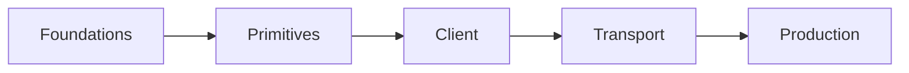

# MCP

> Model Context Protocol — primitives, clients/servers, transport, auth, and production.

**Prerequisites:** [AI Agents](../ai-agents/README.md) · [LLM Application Development](../llm-application-development/README.md)  
**Unlocks:** [Multi-Agent Systems](../multi-agent-systems/README.md) · [AI Security & Guardrails](../ai-security-guardrails/README.md)

Thin lessons deepened 2026-08-12. Start with a section hub below (or expand the topic in the left sidebar).

---

## Sections

| # | Section | What you will learn | Hub |
|---|---------|---------------------|-----|
| 1 | **Foundations** | Intro and concepts | [foundations/](foundations/README.md) |
| 2 | **Primitives** | Resources, prompts, tools | [primitives/](primitives/README.md) |
| 3 | **Client & Server** | Build and integrate | [client-and-server/](client-and-server/README.md) |
| 4 | **Transport & Auth** | Streams and security | [transport-and-auth/](transport-and-auth/README.md) |
| 5 | **Production** | Ops, security, architectures | [production/](production/README.md) |

```mermaid
flowchart LR
  S1[Foundations] --> S2[Primitives] --> S3[Client] --> S4[Transport] --> S5[Production]
```

---

## Hierarchy

### Foundations

| # | Topic |
|---|-------|
| 1 | [Introduction To Mcp](foundations/01-introduction-to-mcp.md) |
| 2 | [Mcp Architecture](foundations/02-mcp-architecture.md) |
| 3 | [Mcp Lifecycle](foundations/03-mcp-lifecycle.md) |
| 4 | [Mcp Core Concepts](foundations/04-mcp-core-concepts.md) |

### Primitives

| # | Topic |
|---|-------|
| 1 | [Mcp Resources](primitives/01-mcp-resources.md) |
| 2 | [Mcp Prompts](primitives/02-mcp-prompts.md) |
| 3 | [Mcp Tools](primitives/03-mcp-tools.md) |
| 4 | [Mcp Message Protocol](primitives/04-mcp-message-protocol.md) |

### Client & Server

| # | Topic |
|---|-------|
| 1 | [Mcp Client](client-and-server/01-mcp-client.md) |
| 2 | [Mcp Server](client-and-server/02-mcp-server.md) |
| 3 | [Build An Mcp Server](client-and-server/03-build-an-mcp-server.md) |
| 4 | [Build An Mcp Client](client-and-server/04-build-an-mcp-client.md) |

### Transport & Auth

| # | Topic |
|---|-------|
| 1 | [Mcp Transport Layer](transport-and-auth/01-mcp-transport-layer.md) |
| 2 | [Mcp Streaming](transport-and-auth/02-mcp-streaming.md) |
| 3 | [Mcp Authentication](transport-and-auth/03-mcp-authentication.md) |
| 4 | [Multi Server Mcp](transport-and-auth/04-multi-server-mcp.md) |

### Production

| # | Topic |
|---|-------|
| 1 | [Production Mcp](production/01-production-mcp.md) |
| 2 | [Mcp Security](production/02-mcp-security.md) |
| 3 | [Mcp Engineering Mistakes](production/03-mcp-engineering-mistakes.md) |
| 4 | [Mcp Real World Architectures](production/04-mcp-real-world-architectures.md) |
| 5 | [Mcp Comparison Guides](production/05-mcp-comparison-guides.md) |

---

## Definition

**MCP** standardizes how hosts connect to external tools, resources, and prompts for LLM applications.

---

## Related topics

- [Domains overview](../README.md)
- [Master Index](../../meta/indexes/MASTER-INDEX.md)
