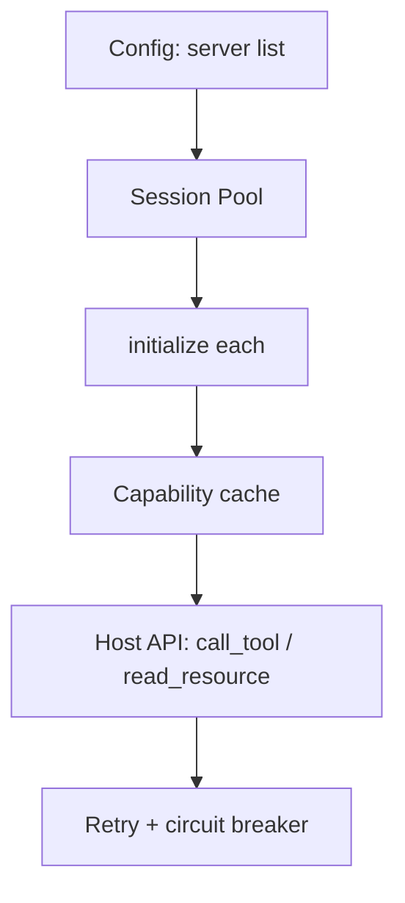

# Build an MCP Client

## Overview

Section **16**.

## Client Architecture



## Implementation Steps

1. **Configure** servers (command, args, env, or HTTP URL)
2. **Connect** transport per server
3. **Initialize** and send `initialized` notification
4. **Discover** tools, resources, prompts
5. **Expose** unified API to agent loop
6. **Handle** errors, retries, reconnection
7. **Test** with mock server

## Python Client

```python
from mcp import ClientSession, StdioServerParameters
from mcp.client.stdio import stdio_client

class McpToolBridge:
    def __init__(self, command: str, args: list[str]):
        self._params = StdioServerParameters(command=command, args=args)
        self._session: ClientSession | None = None

    async def connect(self):
        self._transport = stdio_client(self._params)
        read, write = await self._transport.__aenter__()
        self._session = ClientSession(read, write)
        await self._session.__aenter__()
        await self._session.initialize()

    async def call_tool(self, name: str, arguments: dict):
        assert self._session
        return await self._session.call_tool(name, arguments)

    async def list_tools_for_llm(self) -> list[dict]:
        tools = await self._session.list_tools()
        return [{"name": t.name, "description": t.description, "parameters": t.inputSchema} for t in tools.tools]
```

## Retry Policy

```python
async def call_with_retry(session, name, args, max_attempts=3):
    for attempt in range(max_attempts):
        try:
            return await session.call_tool(name, args)
        except (ConnectionError, TimeoutError):
            if attempt == max_attempts - 1:
                raise
            await asyncio.sleep(2 ** attempt)
```

## Multi-Server

Maintain `dict[server_id, ClientSession]`; route by tool prefix or registry.

## Testing

- Use reference server from [examples/mcp/](../../examples/mcp/)
- Assert `initialize` protocol version compatibility

## Navigation

- [Production MCP](production-mcp.md) · [MCP Client](mcp-client.md)

---

## Changelog

| Version | Date | Changes |
|---------|------|---------|
| 1.0 | 2026-07-13 | Initial publication |
