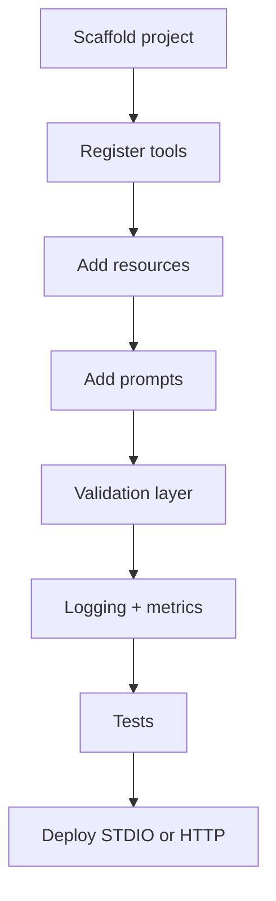

# Build an MCP Server

## Overview

Section **15** of Phase 9 — hands-on server implementation.

## Project Structure

```
mcp-ticket-server/
├── pyproject.toml
├── src/
│   ├── server.py          # MCP entry + handlers
│   ├── tools/             # Tool implementations
│   ├── resources/         # Resource providers
│   ├── prompts/           # Prompt templates
│   ├── auth.py
│   └── config.py
└── tests/
    └── test_tools.py
```

## Steps



1. **Initialize** MCP `Server` with name and version
2. **Register** `@list_tools` / `@call_tool` handlers
3. **Expose** resources with stable URIs
4. **Add** parameterized prompts
5. **Validate** all inputs with JSON Schema / Pydantic
6. **Log** structured JSON with `request_id`
7. **Test** handlers unit tests + integration with test client
8. **Deploy** — subprocess STDIO for IDE; containerized HTTP for remote

## Python Server Skeleton

```python
from mcp.server import Server
from mcp.server.stdio import stdio_server
import mcp.types as types

app = Server("ticket-server")

@app.list_tools()
async def list_tools() -> list[types.Tool]:
    return [types.Tool(
        name="search_tickets",
        description="Search support tickets",
        inputSchema={"type": "object", "properties": {"q": {"type": "string"}}, "required": ["q"]},
    )]

@app.call_tool()
async def call_tool(name: str, arguments: dict) -> list[types.TextContent]:
    if name == "search_tickets":
        results = await search(arguments["q"])
        return [types.TextContent(type="text", text=str(results))]
    raise ValueError(f"Unknown tool: {name}")

if __name__ == "__main__":
    import asyncio
    async def main():
        async with stdio_server() as (r, w):
            await app.run(r, w, app.create_initialization_options())
    asyncio.run(main())
```

## FastAPI Co-hosting

Run MCP over streamable HTTP alongside REST health endpoints — see [examples/mcp/example-fastapi-mcp.py](../../examples/mcp/example-fastapi-mcp.py).

## Testing

- Mock external APIs in tool handlers
- Integration test: spawn server subprocess, run client `initialize` + `tools/call`

## Production Deployment Checklist

- [ ] Health endpoint
- [ ] Graceful shutdown
- [ ] Resource limits (CPU/memory)
- [ ] Secret injection via env
- [ ] Per-tool timeouts

## Navigation

- [Build an MCP Client](build-an-mcp-client.md) · [Examples](../../examples/mcp/)

---

## Changelog

| Version | Date | Changes |
|---------|------|---------|
| 1.0 | 2026-07-13 | Phase 9 Section 15 |
