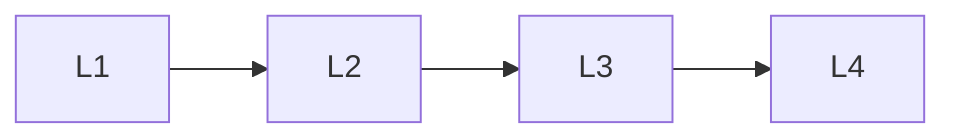

# Client & Server

> Section of the **mcp** handbook.

## Lessons

| # | Lesson |
|---|--------|
| 1 | [Mcp Client](01-mcp-client.md) |
| 2 | [Mcp Server](02-mcp-server.md) |
| 3 | [Build An Mcp Server](03-build-an-mcp-server.md) |
| 4 | [Build An Mcp Client](04-build-an-mcp-client.md) |

**Topic hub:** [../README.md](../README.md)
