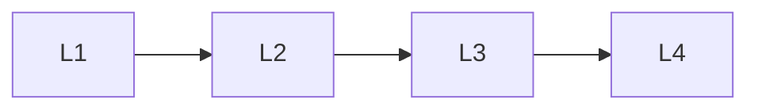

# Foundations

> Section of the **mcp** handbook.

## Lessons

| # | Lesson |
|---|--------|
| 1 | [Introduction To Mcp](01-introduction-to-mcp.md) |
| 2 | [Mcp Architecture](02-mcp-architecture.md) |
| 3 | [Mcp Lifecycle](03-mcp-lifecycle.md) |
| 4 | [Mcp Core Concepts](04-mcp-core-concepts.md) |

**Topic hub:** [../README.md](../README.md)
