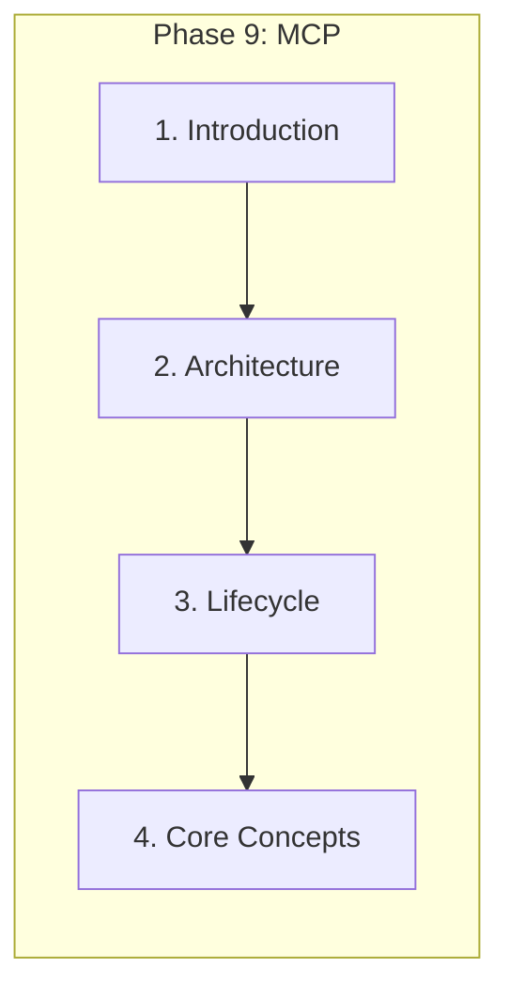
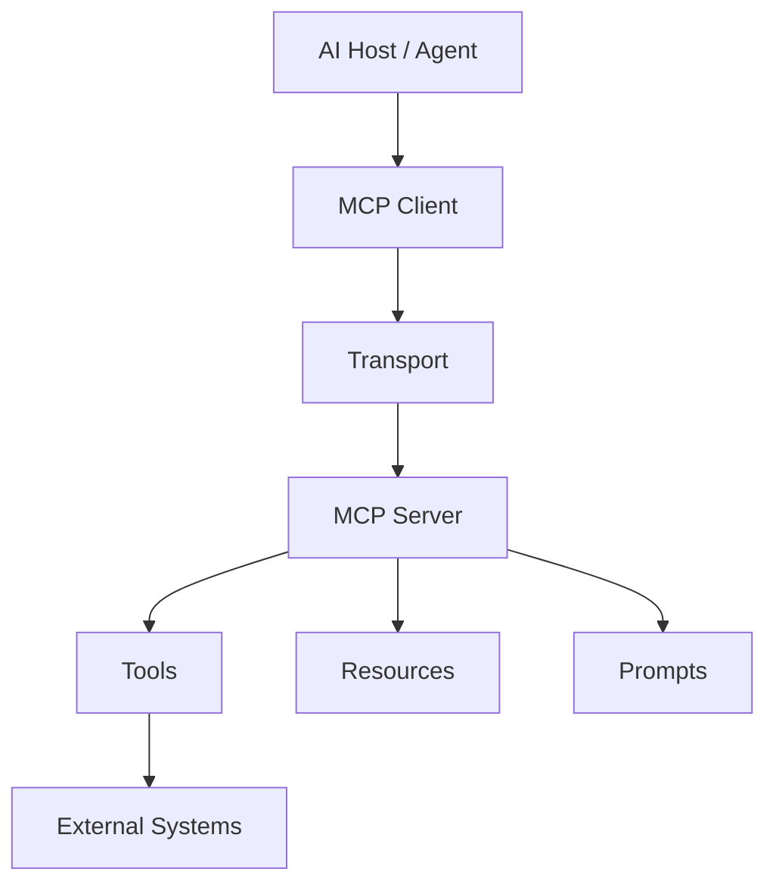

# Introduction to Model Context Protocol

> MCP is a protocol specification for standardized, interoperable communication between AI applications and external capabilities — tools, resources, and prompts — not merely another HTTP API.

## Table of Contents

- [Overview](#overview)
- [What Is MCP?](#what-is-mcp)
- [Why MCP Exists](#why-mcp-exists)
- [Problems MCP Solves](#problems-mcp-solves)
- [Evolution of AI Integrations](#evolution-of-ai-integrations)
- [MCP Ecosystem](#mcp-ecosystem)
- [Protocol Philosophy](#protocol-philosophy)
- [MCP Terminology](#mcp-terminology)
- [Real-World Use Cases](#real-world-use-cases)
- [MCP in AI Agents](#mcp-in-ai-agents)
- [MCP in Enterprise Systems](#mcp-in-enterprise-systems)
- [Engineering Motivation](#engineering-motivation)
- [Production Considerations](#production-considerations)
- [Security Considerations](#security-considerations)
- [Best Practices](#best-practices)
- [Anti-Patterns](#anti-patterns)
- [Python Examples](#python-examples)
- [Interview Preparation](#interview-preparation)
- [Navigation](#navigation)

---

## Overview

**Model Context Protocol (MCP)** defines how **hosts** (IDEs, agents, apps) discover and invoke **servers** that expose **tools**, **resources**, and **prompts** over a structured message protocol with pluggable **transports**.

Section **1** of Phase 9.



> **Prerequisites:** [Phase 8 AI Agents](../ai-agents/README.md) · [Phase 7 RAG](../rag/README.md) · [Tool Use](../ai-agents/tool-use.md)

---

## What Is MCP?

| Term | Definition |
|------|------------|
| **Host** | Application embedding the MCP client (Cursor, Claude Desktop, custom agent) |
| **Client** | Protocol peer that connects to servers on behalf of the host |
| **Server** | Exposes tools, resources, prompts |
| **Transport** | STDIO, HTTP+SSE, streamable HTTP |
| **Capability** | Negotiated feature set (tools, resources, prompts, logging) |



---

## Why MCP Exists

Before MCP, every AI product built **custom integrations** — N×M connectors, inconsistent schemas, no discovery, fragile auth. MCP provides:

- **Standard message format** (JSON-RPC based)
- **Capability discovery** at session init
- **Three primitives** — tools, resources, prompts
- **Transport abstraction** — local STDIO to remote HTTP
- **Ecosystem** of reusable servers (GitHub, Postgres, filesystem)

---

## Problems MCP Solves

| Problem | MCP approach |
|---------|--------------|
| Ad-hoc tool APIs | Standard tool schema + `tools/call` |
| Hardcoded context | URI-addressable **resources** |
| Prompt duplication | Server-hosted **prompts** |
| Integration sprawl | One client, many servers |
| Version drift | Capability negotiation |

---

## Evolution of AI Integrations

1. **Inline functions** — OpenAI function calling in app code
2. **Plugin marketplaces** — vendor-specific
3. **Agent frameworks** — LangChain tools, ad hoc
4. **MCP** — protocol-level interoperability

MCP complements [direct function calling](../llm-engineering/function-calling-and-tools.md); it standardizes **how servers expose** capabilities.

---

## MCP Ecosystem

- **Reference SDKs** — Python, TypeScript
- **Servers** — filesystem, git, databases, SaaS APIs
- **Hosts** — Cursor, Claude Desktop, custom agents
- **Registries** — community server catalogs (emerging)

---

## Protocol Philosophy

- **Composable** — small servers, one concern each
- **Explicit** — schemas for every tool input
- **Inspectable** — list tools/resources at runtime
- **Transport-agnostic** — same messages over STDIO or HTTP

---

## MCP Terminology

See [Core Concepts](mcp-core-concepts.md) for full glossary. Key: `initialize`, `tools/list`, `tools/call`, `resources/read`, `prompts/get`.

---

## Real-World Use Cases

| Use case | MCP role |
|----------|----------|
| IDE coding assistant | Filesystem + git + linter servers |
| Enterprise KB | RAG resource server + ticket tools |
| Data analyst agent | SQL server with read-only tools |
| Ops agent | Monitoring resources + remediation tools |

---

## MCP in AI Agents

Agents become **hosts** — MCP clients discover tools at runtime instead of hardcoding integrations. See [Tool Use](../ai-agents/tool-use.md).

---

## MCP in Enterprise Systems

- Per-tenant MCP servers with RBAC
- Central audit of `tools/call`
- Federated multi-server routing — [Multi-Server MCP](multi-server-mcp.md)

---

## Engineering Motivation

Treat MCP like **gRPC for AI capabilities** — schema-first, versioned, observable, testable.

---

## Production Considerations

- Health checks on servers
- Timeout on every `tools/call`
- Capability cache with TTL

---

## Security Considerations

- Never expose unconstrained shell via MCP without sandbox
- Auth at transport + per-tool permissions

See [MCP Security](mcp-security.md).

---

## Best Practices

1. One server per domain (db, git, crm)
2. Strict JSON Schema on tools
3. Log correlation IDs across client/server

---

## Anti-Patterns

| Anti-Pattern | Why |
|--------------|-----|
| God server with 50 tools | Unmaintainable discovery |
| MCP as generic REST passthrough | Loses schema contracts |
| No auth on remote HTTP transport | Critical vulnerability |

---

## Python Examples

```python
# Conceptual: host discovers tools from MCP server after initialize
async def list_agent_tools(mcp_client) -> list[dict]:
    await mcp_client.initialize()
    return (await mcp_client.list_tools()).tools
```

---

## Interview Preparation

**Q: MCP vs REST API for AI tools?**

> REST is general-purpose HTTP. MCP adds discovery, standardized tool/resource/prompt primitives, session negotiation, and host ecosystem — optimized for LLM agent integration.

**Q: When not use MCP?**

> Simple single-app with few static tools — direct function calling may suffice. MCP wins with multiple integrations, third-party servers, IDE hosts.

---

## Navigation

### Prerequisites

- [AI Agents](../ai-agents/README.md) — Phase 8

### Next

- [MCP Architecture](mcp-architecture.md)

### Unlocks

- [A2A](../a2a/README.md) · Enterprise AI platforms

---

## Changelog

| Version | Date | Changes |
|---------|------|---------|
| 1.0 | 2026-07-13 | Phase 9 Section 1 |
